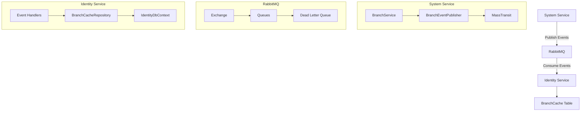

# RabbitMQ Branch Synchronization

## Tổng quan

Hệ thống RabbitMQ Branch Synchronization được thiết kế để đồng bộ dữ liệu Branch giữa System service và Identity service một cách real-time và đáng tin cậy.

## Kiến trúc



## Event Types

### 1. BranchCreatedEvent
- **Trigger**: Khi Branch được tạo mới và approved
- **Payload**: BranchId, Code, Name, BranchType, IsActive, Description, CreatedDate, CreatedBy
- **Queue**: `branch-created-queue`

### 2. BranchUpdatedEvent
- **Trigger**: Khi Branch được cập nhật và approved
- **Payload**: BranchId, Code, Name, BranchType, IsActive, Description, UpdatedDate, UpdatedBy
- **Queue**: `branch-updated-queue`

### 3. BranchDeletedEvent
- **Trigger**: Khi Branch bị xóa và approved
- **Payload**: BranchId, Code, DeletedDate, DeletedBy
- **Queue**: `branch-deleted-queue`

## Cấu hình

### System Service (Publisher)

```json
{
  "RabbitMQ": {
    "Host": "localhost",
    "Port": 5672,
    "Username": "guest",
    "Password": "guest",
    "VirtualHost": "/",
    "RetryCount": 3,
    "RetryDelay": "00:00:05"
  }
}
```

### Identity Service (Consumer)

```json
{
  "RabbitMQ": {
    "Host": "localhost",
    "Port": 5672,
    "Username": "guest",
    "Password": "guest",
    "VirtualHost": "/",
    "RetryCount": 3,
    "RetryDelay": "00:00:05"
  }
}
```

## Database Schema

### BranchCache Table

```sql
CREATE TABLE BRANCH_CACHE (
    ID NUMBER(19) NOT NULL,
    CODE VARCHAR2(50) NOT NULL,
    NAME VARCHAR2(200) NOT NULL,
    BRANCH_TYPE NUMBER(10) NOT NULL,
    IS_ACTIVE CHAR(1) DEFAULT 'Y' NOT NULL,
    DESCRIPTION VARCHAR2(500),
    LAST_SYNCED_AT TIMESTAMP(6) NOT NULL,
    LAST_SYNCED_BY VARCHAR2(100),
    CREATED_DATE TIMESTAMP(6) NOT NULL,
    CREATED_BY VARCHAR2(100),
    UPDATED_DATE TIMESTAMP(6),
    UPDATED_BY VARCHAR2(100),
    CONSTRAINT PK_BRANCH_CACHE PRIMARY KEY (ID)
);
```

## Error Handling

### Retry Policy
- **Retry Count**: 3 lần
- **Retry Delay**: 5 giây
- **Backoff Strategy**: Exponential backoff

### Dead Letter Queue
- Messages thất bại sau 3 lần retry sẽ được chuyển vào Dead Letter Queue
- Có thể xem và xử lý manual từ RabbitMQ Management UI

### Error Logging
- Tất cả errors được log với correlation ID
- Structured logging với Serilog
- Integration với monitoring system

## Monitoring

### Metrics
- Message processing rate
- Error rate
- Queue depth
- Processing latency

### Health Checks
- RabbitMQ connection health
- Consumer health
- Database connection health

### Alerts
- High error rate (>5%)
- Queue depth threshold (>1000 messages)
- Consumer down
- Database connection issues

## Testing

### Unit Tests
```bash
# Chạy unit tests
dotnet test src/Services/System/Flex.System.Api.Tests/
dotnet test src/Services/Identity/Flex.AspNetIdentity.Api.Tests/
```

### Integration Tests
```bash
# Chạy integration tests với RabbitMQ
python tools/test_rabbitmq_branch_sync.py
```

### Load Testing
```bash
# Test với high volume messages
python tools/load_test_rabbitmq.py --messages 1000 --concurrent 10
```

## Deployment

### Docker Compose
```bash
# Start RabbitMQ
docker-compose up -d rabbitmq

# Start services
docker-compose up -d
```

### Kubernetes
```yaml
apiVersion: apps/v1
kind: Deployment
metadata:
  name: rabbitmq
spec:
  replicas: 1
  selector:
    matchLabels:
      app: rabbitmq
  template:
    metadata:
      labels:
        app: rabbitmq
    spec:
      containers:
      - name: rabbitmq
        image: rabbitmq:3.13-management
        ports:
        - containerPort: 5672
        - containerPort: 15672
```

## Troubleshooting

### Common Issues

1. **Message không được xử lý**
   - Kiểm tra RabbitMQ connection
   - Kiểm tra consumer health
   - Xem logs trong Dead Letter Queue

2. **High memory usage**
   - Kiểm tra queue depth
   - Tăng consumer instances
   - Optimize message processing

3. **Database connection issues**
   - Kiểm tra connection string
   - Kiểm tra database health
   - Xem connection pool settings

### Debug Commands

```bash
# Kiểm tra RabbitMQ status
docker exec -it flex-rabbitmq rabbitmq-diagnostics status

# Xem queue information
docker exec -it flex-rabbitmq rabbitmqctl list_queues

# Xem exchange information
docker exec -it flex-rabbitmq rabbitmqctl list_exchanges

# Xem consumer information
docker exec -it flex-rabbitmq rabbitmqctl list_consumers
```

## Best Practices

### 1. Message Design
- Sử dụng immutable events
- Include correlation ID
- Version events properly
- Keep payload size minimal

### 2. Error Handling
- Implement circuit breaker pattern
- Use exponential backoff
- Log all errors with context
- Implement dead letter queue

### 3. Performance
- Use connection pooling
- Implement message batching
- Monitor queue depth
- Scale consumers horizontally

### 4. Security
- Use TLS for connections
- Implement authentication
- Encrypt sensitive data
- Audit message access

### 5. Monitoring
- Set up comprehensive metrics
- Implement health checks
- Use distributed tracing
- Set up alerting

## Future Enhancements

1. **Event Sourcing**: Implement event sourcing pattern
2. **CQRS**: Separate read/write models
3. **Saga Pattern**: Implement distributed transactions
4. **Event Replay**: Ability to replay events
5. **Multi-tenant**: Support multiple tenants
6. **Event Versioning**: Backward compatibility
7. **Event Archiving**: Long-term storage
8. **Real-time Analytics**: Stream processing
