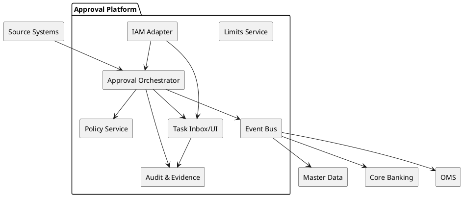
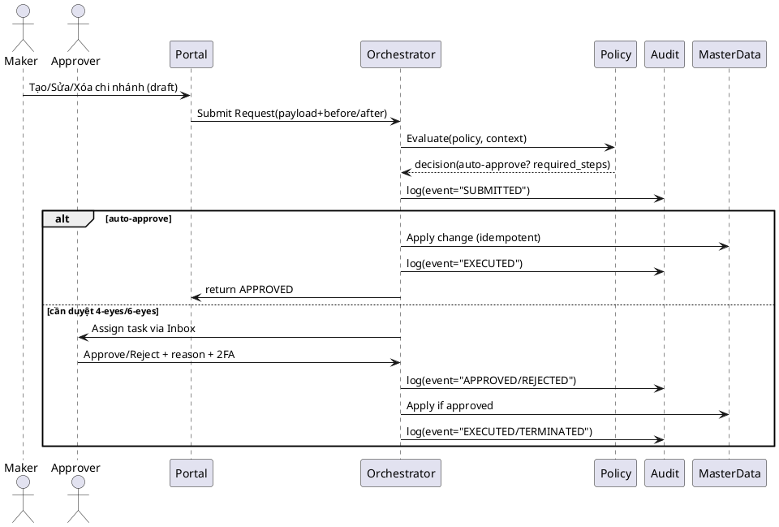

# SPEC-1-Approval-Workflow-Finance

## Background

Các ngân hàng và công ty chứng khoán thường có nhiều nghiệp vụ cần phê duyệt ("luồng duyệt"): chuyển khoản giá trị cao, mở tài khoản/đổi thông tin KYC, cấp hạn mức tín dụng/giao dịch, đặt lệnh chứng khoán vượt ngưỡng rủi ro, chi ngoại bảng, xử lý ngoại lệ/giải soát… Hiện trạng phổ biến là quy trình rời rạc theo phòng ban, phê duyệt qua email/chat, thiếu nhật ký bất biến, không đồng nhất tiêu chí rủi ro và không đáp ứng nguyên tắc SoD (Segregation of Duties) và maker–checker. Điều này dẫn tới rủi ro vận hành/gian lận, vi phạm SLA, khó truy vết kiểm toán và chậm ra quyết định.

Mục tiêu của bản thiết kế là:

* Chuẩn hoá một nền tảng luồng duyệt thống nhất, có thể cấu hình theo chính sách rủi ro và đặc thù nghiệp vụ (banking & brokerage).
* Bảo đảm tuân thủ: SoD, maker–checker (4-eyes/6-eyes), lưu vết bất biến, bằng chứng đính kèm, lý do phê duyệt/từ chối, và truy vết end‑to‑end.
* Hỗ trợ tự động duyệt theo rủi ro (policy-as-code), định tuyến động theo vai trò/giới hạn thẩm quyền, và ngoại lệ có kiểm soát.
* Khả năng mở rộng theo kênh (core banking, digital channels, OMS, back office), thời gian xử lý thấp với yêu cầu thời gian thực ở các kịch bản phù hợp, và cơ chế failover để đảm bảo tính sẵn sàng cao.

**Giả định ban đầu (có thể chỉnh nếu không khớp):**

* Phạm vi gồm: (1) Thanh toán/chuyển khoản nội bộ & liên ngân hàng; (2) Đặt lệnh chứng khoán giá trị cao hoặc vượt ngưỡng margin; (3) Cấp/sửa hạn mức tín dụng & giao dịch; (4) Xử lý ngoại lệ KYC/AML; (5) **Quản trị dữ liệu gốc (master data)** như chi nhánh/điểm giao dịch/đơn vị kinh doanh: **tạo/sửa/xóa cần luồng duyệt**.
* Mục tiêu phi chức năng: auto-approve rủi ro thấp < 2 giây; luồng duyệt thủ công đáp ứng SLA trong 15 phút; audit log bất biến, RTO ≤ 30 phút, RPO ≤ 5 phút.

## Requirements

### Must have (Bắt buộc)

* **Maker–Checker/SoD** cho mọi yêu cầu ảnh hưởng tiền/tài sản hoặc dữ liệu gốc (master data) như chi nhánh. Tối thiểu 4-eyes; hỗ trợ 6-eyes theo ngưỡng.
* **Policy-as-code** để xác định tiêu chí auto-approve/auto-reject theo số tiền, sản phẩm, xếp hạng rủi ro KH, hạn mức, ngày/giờ, kênh, địa lý.
* **Nhật ký audit bất biến** (append-only, băm chuỗi hash chain + time-stamp), lưu lý do, bằng chứng, thay đổi trước/sau (before/after image), và chữ ký số/2FA của người duyệt.
* **Định tuyến theo vai trò & hạn quyền**: ánh xạ IAM/HR (RBAC/ABAC), giới hạn thẩm quyền theo số tiền/ngưỡng rủi ro, interlock phòng ban.
* **SLA**: auto-approve < 2s; thủ công trong 15 phút (quy tắc nhắc nhở & escalations theo thời gian).
* **Khả năng rollback/cancel** có kiểm soát khi phát hiện sai phạm trước khi thực thi cuối.
* **API đồng bộ & bất đồng bộ** cho kênh nguồn (Core Banking, OMS, Back Office, Portal), webhooks/sự kiện cho trạng thái.
* **Tuân thủ**: lưu trữ theo quy định địa phương, quyền riêng tư, lưu trữ tối thiểu 10 năm log phê duyệt (tuỳ chính sách).

### Should have (Nên có)

* **Simulate/what-if** trước khi áp chính sách mới; kiểm thử A/B chính sách.
* **Bộ quy tắc ngoại lệ kiểm soát** (e.g., khẩn cấp/after-hours) với lý do & phê duyệt cấp cao.
* **Đo lường & dashboard**: tỉ lệ auto-approve, thời gian chu kỳ, nút thắt, người duyệt quá tải.
* **Ủy quyền (delegation)** có thời hạn; **song song/tuần tự** nhiều cấp duyệt; **quorum** (ví dụ 2/3).
* **DLP** cho tệp đính kèm; kiểm tra virus/malware.

### Could have (Có thể có)

* **Notarization ngoài hệ thống** (e.g., anchor hash lên dịch vụ timestamp công) cho một số hành vi nhạy cảm.
* **ML gợi ý rủi ro** để xếp hàng ưu tiên hoặc đề xuất quyết định.

### Won’t have (Không làm ở MVP)

* Không tự động thay thế các hệ thống phê duyệt đặc thù đã được quy định pháp lý riêng nếu cần chứng chỉ chuyên ngành; sẽ tích hợp ở mức yêu cầu.

---

**Ghi nhận ưu tiên NFR:** cân bằng nhưng **nghiêng về kiểm toán/tuân thủ** trong phiên bản đầu (ưu tiên tính đúng/đủ & traceability).

---

**Vui lòng xác nhận phần Requirements trên.**

1. Hệ thống danh tính/role hiện tại là gì (AD/Azure AD/Keycloak…)? *Giả định*: dùng AD/Azure AD làm nguồn sự thật RBAC.
2. Có cần **notarization ngoài hệ thống** (ví dụ đóng dấu thời gian công) hay chỉ cần **hash chain nội bộ** cho audit là đủ ở MVP?

## Method

### Kiến trúc tổng quan

* **Approval Orchestrator** (workflow engine): điều phối trạng thái yêu cầu, fan-out tới nhiều cấp duyệt (tuần tự/song song/quorum), timeouts/escalation. Có thể triển khai với **Temporal** hoặc **Camunda 8 (Zeebe)**; MVP chọn 1 trong 2, hoặc state machine nội bộ nếu hạ tầng hạn chế.
* **Policy Service (OPA)**: đánh giá auto-approve/reject bằng policy-as-code (Rego), tách biệt khỏi ứng dụng nghiệp vụ.
* **Audit & Evidence Service**: ghi **append-only** + **hash chain** cho mọi sự kiện; lưu bằng chứng (file, ảnh, chữ ký OTP) với checksum.
* **Task Inbox/UI**: hàng đợi việc cho người duyệt theo vai trò/hạn quyền, desktop & mobile.
* **Limits/Authority Service**: quản lý hạn mức phê duyệt theo vai trò/cá nhân/đơn vị/giờ.
* **IAM Adapter**: tích hợp hệ RBAC nội bộ; cung cấp token hóa quyền ở runtime (RBAC + thuộc tính giao dịch cơ bản).
* **Connectors**: Core Banking, Payment Hub, OMS, Master Data (Branch), DWH/BI; sử dụng **Event Outbox** + **Idempotency**.



### Luồng điển hình

**A) CRUD chi nhánh (master data)**



**B) Thanh toán/đặt lệnh giá trị cao** (định tuyến theo hạn mức và SoD): tương tự A, nhưng Orchestrator kiểm tra **SoD** để đảm bảo người duyệt ≠ người tạo, và áp dụng **quorum** nếu vượt ngưỡng.

### Lược đồ dữ liệu (PostgreSQL đề xuất)

* `approval_request(id, tenant_id, source_system, business_type, business_id, maker_id, payload_before jsonb, payload_after jsonb, amount numeric, currency, risk_score int, status, created_at, updated_at)`
* `approval_step(id, request_id, seq int, type enum('serial','parallel','quorum'), required int, state, assigned_queue, due_at)`
* `approval_action(id, step_id, approver_id, action enum('approve','reject','delegate'), reason, otp_verified bool, signed_at, signature_hash)`
* `policy_snapshot(id, request_id, policy_sha256, input_sha256, decision enum('auto_approve','manual','reject'), evaluated_at)`
* `audit_log(id, request_id, event, actor_id, metadata jsonb, created_at, prev_hash, curr_hash)`
* `attachments(id, request_id, filename, mime, size, sha256, storage_url)`
* `iam_user(id, username, dept, status)`
* `iam_role(id, name)`; `iam_user_role(user_id, role_id)`
* `approval_limit(id, role_id, product, max_amount numeric, currency, window_start, window_end)`
* **Outbox**: `event_outbox(id, aggregate, aggregate_id, event_type, payload jsonb, created_at, sent_at)`
* **Idempotency**: `idempotency_key(key, request_fingerprint, created_at)`

### Thuật toán & quy tắc trọng yếu

**1) Hash-chain audit**

```
prev = last_log.curr_hash (or GENESIS)
material = concat(request_id, event, actor_id, metadata_json, timestamp, prev)
curr_hash = SHA256(material)
store(prev, curr_hash)
```

* Cơ chế **periodic anchor**: mỗi giờ lưu anchor hash của dãy log gần nhất vào kho riêng (hoặc HSM).

**2) Maker–Checker/SoD**

```
assert maker_id != approver_id
assert approver has role in allowed_roles and within approval_limit for amount/product
for parallel/quorum: require >= required approvals
```

**3) Policy-as-code (OPA/Rego) – ví dụ rút gọn**

```rego
package approval.payment

default decision := {"result": "manual"}

# Auto-approve nếu số tiền < hạn mức role thấp nhất và KH rủi ro thấp
allow_auto {
  input.amount < input.policy.min_role_limit
  input.customer.risk == "LOW"
  not after_hours
}

after_hours { input.context.hour < 8 or input.context.hour > 18 }

decision := {"result": "auto"} { allow_auto }
# Có thể trả về required_steps khi manual
```

**4) Escalation & SLA**

* Orchestrator đặt **timer** cho từng bước; quá hạn → nhắc nhở, rồi **escalate** lên cấp cao hơn.

**5) Idempotency & Exactly-once (thực thi)**

* Trước khi áp thay đổi/ghi sổ: kiểm tra `idempotency_key` hoặc `business_id + version` để tránh lặp.
* Dùng **Outbox** + consumer idempotent để phát sự kiện xuống hệ thống đích.

### Bảo mật & tuân thủ

* 2FA/OTP cho hành động phê duyệt; chữ ký số hoặc HSM nếu khả dụng.
* Masking dữ liệu nhạy cảm trong UI và log.
* Phân quyền xem bằng **need-to-know** (RBAC hiện có + scope giao dịch).

### Hiệu năng & HA

* Policy Service và Orchestrator scale theo chiều ngang.
* Sử dụng Kafka/RabbitMQ cho hàng đợi tác vụ & event; Postgres dùng **partitioning** cho `audit_log`/`approval_action`.
* RTO ≤ 30’, RPO ≤ 5’: backup streaming + multi-AZ.

## Implementation

### Công nghệ đã chọn

* **Orchestrator**: Temporal (Server + Worker SDK Java).
* **CSDL**: Oracle (≥ 19c). Dùng **partition** theo tháng cho audit/activities, **Advanced Queuing** không dùng trong MVP (vì RabbitMQ).
* **Message broker**: RabbitMQ (HA mirrored queues / quorum queues tuỳ bản).
* **IAM**: hệ RBAC nội bộ (adapter REST).
* **Container**: Kubernetes (2 AZ), Ingress + mTLS nội bộ.

### Triển khai thành phần

1. **Temporal Cluster**

   * 3–5 node **Frontend**, 3–5 **History**, 3–5 **Matching**, 3–5 **Worker system**; DB backend: **PostgreSQL cho Temporal** (khuyến nghị của Temporal). *Lưu ý*: Temporal **không chạy trên Oracle** → dùng Postgres riêng cho Temporal, business data ở Oracle.
   * Namespace: `approval-prod`, retention 30 ngày.
2. **Approval Orchestrator Service (Worker)**

   * Định nghĩa **Workflow**: `ApprovalWorkflow` với input `ApprovalRequest`.
   * **Activities**: `EvaluatePolicy`, `PersistRequest`, `AssignTasks`, `CollectApprovals`, `ExecuteChange`, `EmitEvents`, `WriteAudit`, `Escalate`.
   * Timeouts: activity 10s–60s; workflow run timeout 7 ngày.
3. **Policy Service**

   * OPA sidecar hoặc service riêng; policy quản lý bằng git (policy SHA256).
4. **Audit & Evidence**

   * Lưu log vào Oracle bảng `AUDIT_LOG` (append-only) + **hash-chain** bằng `DBMS_CRYPTO.HASH(SHA256)`.
   * File đính kèm: lưu object storage (S3-compatible) + metadata trong Oracle.
5. **Task Inbox/UI**

   * Web React hoặc Angular; backend GraphQL/REST. Realtime update qua webhooks hoặc poll.
6. **Connectors**

   * **Master Data Adapter** (chi nhánh), **Payments Adapter**, **OMS Adapter**. Nhận sự kiện qua RabbitMQ.

### RabbitMQ topology

* Exchange `approval.events` (topic) phát `request.created`, `step.assigned`, `request.approved/rejected`, `request.executed`.
* Queue: `md.apply`, `payments.apply`, `oms.apply`, `bi.sink` (binding theo routing key tương ứng).
* Bật **publisher confirms**, **consumer ack**, **dead-letter exchange** `approval.dlx` cho retry.

### Outbox & Exactly-once

* Bảng `EVENT_OUTBOX` trong Oracle. Ghi trong cùng giao dịch với cập nhật nghiệp vụ.
* Cron worker (hoặc Debezium Oracle CDC nếu có) đọc outbox và publish lên RabbitMQ; đánh dấu `SENT_AT` khi confirm.

### Lược đồ Oracle (rút gọn)

```sql
-- Business requests
CREATE TABLE APPROVAL_REQUEST (
  ID               NUMBER GENERATED BY DEFAULT AS IDENTITY PRIMARY KEY,
  TENANT_ID        VARCHAR2(36),
  SOURCE_SYSTEM    VARCHAR2(50),
  BUSINESS_TYPE    VARCHAR2(50),
  BUSINESS_ID      VARCHAR2(100),
  MAKER_ID         VARCHAR2(50),
  PAYLOAD_BEFORE   CLOB,
  PAYLOAD_AFTER    CLOB,
  AMOUNT           NUMBER(20,4),
  CURRENCY         VARCHAR2(3),
  RISK_SCORE       NUMBER(5),
  STATUS           VARCHAR2(20),
  CREATED_AT       TIMESTAMP(6) WITH TIME ZONE DEFAULT SYSTIMESTAMP,
  UPDATED_AT       TIMESTAMP(6) WITH TIME ZONE
);
CREATE INDEX IX_REQ_BT ON APPROVAL_REQUEST (BUSINESS_TYPE, BUSINESS_ID);

CREATE TABLE APPROVAL_STEP (
  ID               NUMBER GENERATED BY DEFAULT AS IDENTITY PRIMARY KEY,
  REQUEST_ID       NUMBER REFERENCES APPROVAL_REQUEST(ID),
  SEQ              NUMBER(5),
  STEP_TYPE        VARCHAR2(10), -- serial|parallel|quorum
  REQUIRED_CNT     NUMBER(3),
  STATE            VARCHAR2(20),
  ASSIGNED_QUEUE   VARCHAR2(100),
  DUE_AT           TIMESTAMP(6) WITH TIME ZONE
);

CREATE TABLE APPROVAL_ACTION (
  ID               NUMBER GENERATED BY DEFAULT AS IDENTITY PRIMARY KEY,
  STEP_ID          NUMBER REFERENCES APPROVAL_STEP(ID),
  APPROVER_ID      VARCHAR2(50),
  ACTION           VARCHAR2(10), -- approve|reject|delegate
  REASON           VARCHAR2(500),
  OTP_VERIFIED     NUMBER(1),
  SIGNED_AT        TIMESTAMP(6) WITH TIME ZONE,
  SIGNATURE_HASH   VARCHAR2(128)
);

CREATE TABLE POLICY_SNAPSHOT (
  ID               NUMBER GENERATED BY DEFAULT AS IDENTITY PRIMARY KEY,
  REQUEST_ID       NUMBER REFERENCES APPROVAL_REQUEST(ID),
  POLICY_SHA256    VARCHAR2(64),
  INPUT_SHA256     VARCHAR2(64),
  DECISION         VARCHAR2(20),
  EVALUATED_AT     TIMESTAMP(6) WITH TIME ZONE
);

CREATE TABLE AUDIT_LOG (
  ID               NUMBER GENERATED BY DEFAULT AS IDENTITY PRIMARY KEY,
  REQUEST_ID       NUMBER,
  EVENT            VARCHAR2(40),
  ACTOR_ID         VARCHAR2(50),
  METADATA         CLOB,
  CREATED_AT       TIMESTAMP(6) WITH TIME ZONE DEFAULT SYSTIMESTAMP,
  PREV_HASH        VARCHAR2(64),
  CURR_HASH        VARCHAR2(64)
) PARTITION BY RANGE (CREATED_AT) INTERVAL (NUMTOYMINTERVAL(1,'MONTH')) (
  PARTITION P0 VALUES LESS THAN (TO_TIMESTAMP_TZ('2025-01-01 00:00:00 +00:00','YYYY-MM-DD HH24:MI:SS TZH:TZM'))
);

CREATE TABLE ATTACHMENTS (
  ID               NUMBER GENERATED BY DEFAULT AS IDENTITY PRIMARY KEY,
  REQUEST_ID       NUMBER REFERENCES APPROVAL_REQUEST(ID),
  FILENAME         VARCHAR2(255),
  MIME             VARCHAR2(100),
  SIZE_BYTES       NUMBER(20),
  SHA256           VARCHAR2(64),
  STORAGE_URL      VARCHAR2(500)
);

CREATE TABLE APPROVAL_LIMIT (
  ID               NUMBER GENERATED BY DEFAULT AS IDENTITY PRIMARY KEY,
  ROLE_ID          VARCHAR2(50),
  PRODUCT          VARCHAR2(50),
  MAX_AMOUNT       NUMBER(20,4),
  CURRENCY         VARCHAR2(3),
  WINDOW_START     VARCHAR2(5), -- HH:mm
  WINDOW_END       VARCHAR2(5)
);

CREATE TABLE EVENT_OUTBOX (
  ID               NUMBER GENERATED BY DEFAULT AS IDENTITY PRIMARY KEY,
  AGGREGATE        VARCHAR2(50),
  AGGREGATE_ID     VARCHAR2(100),
  EVENT_TYPE       VARCHAR2(50),
  PAYLOAD          CLOB,
  CREATED_AT       TIMESTAMP(6) WITH TIME ZONE DEFAULT SYSTIMESTAMP,
  SENT_AT          TIMESTAMP(6) WITH TIME ZONE
);

CREATE TABLE IDEMPOTENCY_KEY (
  KEY              VARCHAR2(128) PRIMARY KEY,
  FINGERPRINT      VARCHAR2(128),
  CREATED_AT       TIMESTAMP(6) WITH TIME ZONE DEFAULT SYSTIMESTAMP
);
```

**Tính toán hash-chain trong DB (PL/SQL)**

```sql
CREATE OR REPLACE PROCEDURE APPEND_AUDIT(
  p_request_id IN NUMBER,
  p_event      IN VARCHAR2,
  p_actor_id   IN VARCHAR2,
  p_metadata   IN CLOB
) AS
  v_prev VARCHAR2(64);
  v_material CLOB;
  v_hash_raw RAW(32);
  v_hash_hex VARCHAR2(64);
BEGIN
  SELECT curr_hash INTO v_prev FROM audit_log
   WHERE request_id = p_request_id ORDER BY id DESC FETCH FIRST 1 ROWS ONLY;
EXCEPTION WHEN NO_DATA_FOUND THEN v_prev := 'GENESIS';
END;
/
-- Insert and compute hash in app layer (khuyến nghị) hoặc dùng trigger tạo v_hash_hex = LOWER(RAWTOHEX(DBMS_CRYPTO.HASH(UTL_RAW.CAST_TO_RAW(material), DBMS_CRYPTO.HASH_SH256)))
```

### API hợp đồng (rút gọn)

* `POST /api/approvals` → tạo yêu cầu (body: business_type, business_id, payload_before/after, amount, …) → trả id + status.
* `POST /api/approvals/{id}/actions` → approve/reject (reason, otp_code). Enforce SoD.
* Webhook: `POST {callback}/approval-events` cho kênh nguồn.

### Temporal – phác thảo Workflow/Activity

```java
// Workflow
@WorkflowInterface
public interface ApprovalWorkflow {
  @WorkflowMethod
  ApprovalResult run(ApprovalInput input);
}

public class ApprovalWorkflowImpl implements ApprovalWorkflow {
  private final Activities activities = Workflow.newActivityStub(Activities.class,
     ActivityOptions.newBuilder().setStartToCloseTimeout(Duration.ofSeconds(30)).build());
  public ApprovalResult run(ApprovalInput in){
    var policy = activities.evaluatePolicy(in);
    activities.persistRequest(in, policy);
    if (policy.autoApprove()) {
      activities.executeChange(in);
      activities.writeAudit(in, "EXECUTED");
      return ApprovalResult.approved();
    }
    activities.assignTasks(in);
    var outcome = activities.collectApprovals(in, Duration.ofMinutes(15));
    if (outcome.approved()) { activities.executeChange(in); }
    activities.emitEvents(in, outcome);
    return outcome;
  }
}
```

### Bảo mật & vận hành

* mTLS service-to-service; JWT từ IAM nội bộ; ký hành động duyệt bằng OTP/HSM khi có.
* Logging có **trace-id** xuyên suốt (OpenTelemetry), dashboard SLA & backlog.
* Backup Oracle theo ARCHIVELOG + standby; RabbitMQ cluster quorum 3 node.

### Kiểm thử

* Unit test policy & SoD; integration test Temporal; load test: 500 RPS tạo yêu cầu, 100 RPS hành động duyệt.

---

Tài liệu UI/Backoffice – Quản Trị WorkflowDefinition

1) Mục Tiêu
- Quản trị WorkflowDefinition an toàn, có versioning, kiểm thử (simulate), và publish theo maker–checker; đảm bảo backward‑compat cho request đang chạy.

2) Màn Hình
- Danh sách
  - Cột: Code, Name, Version, State (Draft/Active/Deprecated), IsActive, UpdatedAt/By.
  - Tìm kiếm: Code/Name, State, IsActive.
  - Hành động: View, Edit (Draft), Duplicate (tạo Draft từ bản đang xem), Publish, Deprecate, History.
- Chi tiết/Chỉnh sửa (Draft)
  - Thông tin chung: Code (read‑only nếu đã có version trước), Name, Description, Version (tự tăng khi duplicate), State (Draft/Active/Deprecated), IsActive.
  - Cấu hình Steps (JSON/Designer):
    - Steps: id, name, group (tùy chọn), quorum, approverRoles[].
    - Groups: code, type (sequential/parallel), quorum.
  - UI Designer (nếu có): thêm/sửa/xóa bước, kéo thả, gán nhóm, set quorum.
  - Policy (JSON): cho nhập rule đơn giản (mode=simple) hoặc Rego (OPA).
- Tham số chung
  - Timeout từng bước (optional), Escalation (optional), Webhooks (optional).
  - Preview & Validate: Validate JSON (schema), Validate roles tồn tại.
  - Simulate: nhập payload mẫu → decision (auto/manual) và pipeline dự kiến.
  - Lưu: Save Draft / Save & Request Publish.
- Lịch sử/So sánh Version
  - Danh sách version theo Code: v1, v2, … (State, UpdatedBy/At).
  - Diff view: so sánh Steps/Policy giữa 2 version.

3) Phê Duyệt Publish (Maker–Checker)
- Hàng đợi: các yêu cầu “Publish WorkflowDefinition”.
- Xem chi tiết thay đổi + Simulate trước khi Approve.
- Hành động: Approve/Reject (lý do).
- Sau khi Approve: State=Active cho version mới; (tùy chọn) Deprecate bản Active cũ.

4) Trường Dữ Liệu Cần Nhập
- General: Code, Name, Description, Version (auto), State, IsActive.
- Steps JSON: steps: [{ id, name, group?, quorum, approverRoles[] }]; groups: [{ code, type: sequential|parallel, quorum }].
- Policy JSON (simple): { mode: "simple", rules: [{ when, op, value, then: "auto|manual|reject" }] }.
- Tuỳ chọn: timeouts/escalation, webhooks, notes thay đổi (change log).

5) Quyền Hạn
- Viewer: xem list/chi tiết/version/history.
- Editor (Maker): tạo Draft, sửa Draft, simulate, gửi request Publish.
- Approver (Checker): xem request Publish, simulate, Approve/Reject.
- Admin/Architect: Deprecate/Activate thủ công (có log), sửa role mapping, global settings.

6) Luồng Nghiệp Vụ
- Tạo mới/nhân bản Definition (Draft) → soạn Steps/Policy → Validate/Simulate → Gửi Publish.
- Checker mở request Publish → đọc diff + simulate → Approve.
- Hệ thống Publish: State vN = Active; v(N‑1) = Deprecated (tùy chọn).
- Request mới trong WorkflowRequest chạy theo version Active tại thời điểm tạo.
- Theo dõi: audit (ai sửa, ai duyệt), outbox events (definition.published) → UI/BI.

7) Ràng Buộc & Kiểm Tra
- Code unique theo domain (toàn hệ thống).
- Không cho sửa in‑place bản Active; chỉ cho duplicate thành Draft.
- Validate: JSON đúng schema; id/nhóm/quorum hợp lệ; approverRoles phải tồn tại trên IAM; quorum ≤ số bước group; group code không trùng.
- Backward compatibility: Request đang chạy giữ version cũ; version mới áp dụng cho request mới.

8) Tích Hợp
- API
  - GET /api/definitions?onlyActive
  - GET /api/definitions/{code}
  - POST /api/definitions (Upsert Draft)
  - POST /api/definitions/{code}/publish (create publish request)
  - GET /api/definitions/{code}/versions
  - POST /api/definitions/{code}/simulate
- Events (Outbox)
  - definition.published, definition.deprecated
- Webhooks: (tuỳ chọn) khi publish/rollback.
