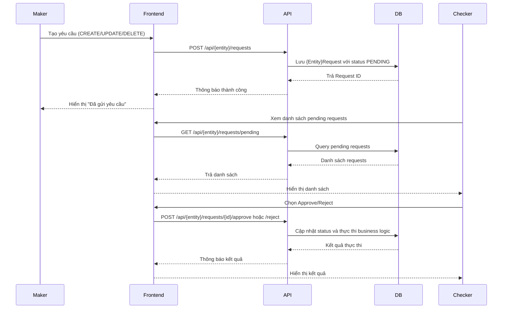

# Hệ Thống Workflow Duyệt (Maker-Checker)  

## 1. Thông tin chung
- **Mã tính năng**: `FT-WORKFLOW-GENERIC`  
- **Module liên quan**: Tất cả modules có entity cần duyệt  
- **Người phụ trách**: Development Team  
- **Ngày viết**: 2025-01-03  
- **Phiên bản**: v1.0

---

## 2. Mục tiêu
Hệ thống workflow duyệt (Maker-Checker) được thiết kế để đảm bảo tính kiểm soát và tuân thủ trong các thao tác quan trọng của hệ thống. Tất cả các thao tác CREATE, UPDATE, DELETE trên các entity quan trọng đều phải trải qua quy trình duyệt hai cấp: Maker (người tạo yêu cầu) và Checker (người duyệt yêu cầu).

**Giá trị mang lại:**
- Đảm bảo tính nhất quán và chính xác của dữ liệu
- Kiểm soát quyền hạn và trách nhiệm rõ ràng
- Audit trail đầy đủ cho các thay đổi quan trọng
- Tuân thủ các quy định về kiểm soát nội bộ
- Pattern có thể áp dụng cho bất kỳ entity nào

---

## 3. Phạm vi
- **In-scope**: 
  - Bất kỳ entity nào cần kiểm soát thay đổi
  - Luồng duyệt: PENDING → APPROVED/REJECTED
  - Audit trail và history tracking
  - Generic pattern cho tất cả modules

- **Out-of-scope**: 
  - Các thao tác đọc dữ liệu (GET operations)
  - Authentication/Authorization (đã có hệ thống riêng)
  - Business logic cụ thể của từng entity

---

## 4. Luồng nghiệp vụ
### 4.1 Mô tả tổng quan
Hệ thống workflow hoạt động theo mô hình Maker-Checker với 3 trạng thái chính:
- **PENDING (UNA)**: Yêu cầu đang chờ duyệt
- **APPROVED (AUT)**: Yêu cầu đã được phê duyệt và thực thi
- **REJECTED (REJ)**: Yêu cầu bị từ chối

### 4.2 Các bước chi tiết
1. **Maker** tạo yêu cầu (CREATE/UPDATE/DELETE) → Trạng thái PENDING
2. **Checker** xem xét và quyết định:
   - **Approve**: Thực thi thao tác → Trạng thái APPROVED
   - **Reject**: Từ chối yêu cầu → Trạng thái REJECTED
3. Hệ thống ghi nhận audit trail và cập nhật history



---

## 5. Yêu cầu chức năng
### 5.1 Functional Requirements
| ID | Mô tả | Ưu tiên | Ghi chú |
|----|-------|---------|---------|
| FR-001 | Maker tạo yêu cầu CREATE/UPDATE/DELETE | Cao | Lưu vào bảng {Entity}Requests với status PENDING |
| FR-002 | Checker xem danh sách pending requests | Cao | Phân trang và tìm kiếm theo keyword |
| FR-003 | Checker phê duyệt yêu cầu | Cao | Thực thi logic và cập nhật status APPROVED |
| FR-004 | Checker từ chối yêu cầu | Cao | Cập nhật status REJECTED với lý do |
| FR-005 | Xem chi tiết yêu cầu | Cao | Hiển thị oldData/newData cho UPDATE requests |
| FR-006 | Xem lịch sử thay đổi entity | Trung bình | Audit trail cho tất cả thao tác |
| FR-007 | Validation dữ liệu đầu vào | Cao | FluentValidation cho tất cả DTOs |
| FR-008 | Kiểm tra duplicate requests | Cao | Tránh duplicate pending requests |

### 5.2 Non-Functional Requirements
| ID | Mô tả | Ưu tiên | Metric | Ghi chú |
|----|-------|---------|--------|---------|
| NFR-001 | Performance | Cao | <500ms cho approve/reject operations | Database optimization |
| NFR-002 | Security | Cao | Role-based access control | Permission-based endpoints |
| NFR-003 | Data Integrity | Cao | ACID transactions | Database constraints |
| NFR-004 | Audit Trail | Cao | Complete change history | Immutable audit logs |
| NFR-005 | Scalability | Trung bình | Hỗ trợ >1000 concurrent requests | Connection pooling |

---

## 6. Thiết kế API
### 6.1 Generic Endpoints Pattern
**Cho bất kỳ entity nào:**
- `POST /api/{entity}/requests` - Tạo yêu cầu thay đổi entity
- `GET /api/{entity}/requests/pending` - Lấy danh sách pending requests
- `GET /api/{entity}/requests/pending/{id}` - Lấy chi tiết request
- `POST /api/{entity}/requests/pending/{id}/approve` - Phê duyệt request
- `POST /api/{entity}/requests/pending/{id}/reject` - Từ chối request
- `GET /api/{entity}/history/{entityId}` - Lấy lịch sử thay đổi entity

### 6.2 Request Examples
**Create Entity Request:**
```json
{
  "field1": "value1",
  "field2": "value2",
  "comments": "Lý do tạo mới"
}
```

**Update Entity Request:**
```json
{
  "entityId": 123,
  "field1": "newValue1",
  "field2": "newValue2",
  "comments": "Lý do cập nhật"
}
```

**Approve Request:**
```json
{
  "comments": "Phê duyệt thay đổi"
}
```

**Reject Request:**
```json
{
  "rejectionReason": "Lý do từ chối"
}
```

### 6.3 Response Examples
**Pending Request List:**
```json
{
  "isSuccess": true,
  "data": {
    "items": [
      {
        "requestId": 123,
        "entityName": "Entity Name",
        "requestType": "CREATE",
        "requestedBy": "maker",
        "requestedDate": "2025-01-03T10:30:00Z",
        "status": "PENDING"
      }
    ],
    "totalCount": 1,
    "pageIndex": 1,
    "pageSize": 10
  }
}
```

**Request Detail:**
```json
{
  "isSuccess": true,
  "data": {
    "requestId": 123,
    "type": "CREATE",
    "requestedBy": "maker",
    "requestedDate": "2025-01-03T10:30:00Z",
    "newData": {
      "field1": "value1",
      "field2": "value2"
    },
    "oldData": null
  }
}
```

### 6.4 Error Codes
| Code | Message | Ý nghĩa |
|------|---------|---------|
| 400 | Bad Request | Input validation failed |
| 401 | Unauthorized | Không có quyền truy cập |
| 403 | Forbidden | Không có quyền thực hiện thao tác |
| 404 | Not Found | Request không tồn tại |
| 409 | Conflict | Duplicate request hoặc conflict data |
| 500 | Internal Server Error | Server error |

---

## 7. Database Impact
### 7.1 Generic Database Pattern
**Base Entity Tables:**
- `{ENTITY_NAME}` - Bảng entity chính (ví dụ: USERS, ROLES, BRANCHES)
- `{ENTITY_NAME}_REQUESTS` - Bảng yêu cầu thay đổi entity

**Common Fields cho tất cả Entity Tables:**
- `STATUS` VARCHAR2(3) - Trạng thái entity (UNA, AUT, REJ)
- `CREATED_DATE` TIMESTAMP - Ngày tạo
- `CREATED_BY` VARCHAR2(256) - Người tạo
- `UPDATED_DATE` TIMESTAMP - Ngày cập nhật
- `UPDATED_BY` VARCHAR2(256) - Người cập nhật

### 7.2 RequestBase Table Structure
```sql
-- Generic structure cho tất cả request tables
CREATE TABLE {ENTITY}_REQUESTS (
    ID NUMBER(19) PRIMARY KEY,
    ENTITY_ID NUMBER(19) NOT NULL,
    ACTION VARCHAR2(20) NOT NULL, -- CREATE, UPDATE, DELETE
    STATUS VARCHAR2(10) DEFAULT 'UNA', -- UNA, AUT, REJ
    REQUESTED_DATA CLOB NOT NULL, -- JSON data
    COMMENTS NVARCHAR2(500),
    MAKER_ID VARCHAR2(256) NOT NULL,
    REQUESTED_DATE TIMESTAMP DEFAULT CURRENT_TIMESTAMP,
    CHECKER_ID VARCHAR2(256),
    APPROVE_DATE TIMESTAMP,
    CREATED_DATE TIMESTAMP DEFAULT CURRENT_TIMESTAMP,
    CREATED_BY VARCHAR2(256),
    UPDATED_DATE TIMESTAMP,
    UPDATED_BY VARCHAR2(256)
);

-- Generic indexes cho performance
CREATE INDEX IX_{ENTITY}_REQUESTS_STATUS ON {ENTITY}_REQUESTS(STATUS);
CREATE INDEX IX_{ENTITY}_REQUESTS_ENTITY_ID ON {ENTITY}_REQUESTS(ENTITY_ID);
CREATE INDEX IX_{ENTITY}_REQUESTS_MAKER_ID ON {ENTITY}_REQUESTS(MAKER_ID);
CREATE INDEX IX_{ENTITY}_REQUESTS_REQUESTED_DATE ON {ENTITY}_REQUESTS(REQUESTED_DATE);
```

### 7.3 Entity Tables với Status
```sql
-- Tất cả entity tables đều có cột STATUS
ALTER TABLE {ENTITY} ADD STATUS VARCHAR2(3) DEFAULT 'AUT';

-- Generic index cho STATUS
CREATE INDEX IX_{ENTITY}_STATUS ON {ENTITY}(STATUS);
```

### 7.4 Data Flow Pattern
1. **CREATE Request**: `ENTITY_ID = 0`, `REQUESTED_DATA` chứa data mới
2. **UPDATE Request**: `ENTITY_ID = actual_id`, `REQUESTED_DATA` chứa oldData + newData
3. **DELETE Request**: `ENTITY_ID = actual_id`, `REQUESTED_DATA` chứa snapshot data

---

## 8. UI/UX Design Guidelines
### 8.1 Generic Visual Design
- **Màu sắc chuẩn**: 
  - Pending: #ffc107 (Warning - Vàng)
  - Approved: #28a745 (Success - Xanh lá)
  - Rejected: #dc3545 (Danger - Đỏ)
  - Primary: #007bff (Bootstrap blue)

### 8.2 Generic User Experience
- **Pending Requests List**: 
  - Hiển thị badge màu theo trạng thái
  - Icon phân biệt loại request (CREATE/UPDATE/DELETE)
  - Search và filter theo keyword
  - Pagination cho danh sách lớn
- **Request Detail Modal**: 
  - Side-by-side comparison cho UPDATE requests
  - Highlight các field thay đổi
  - Loading states khi approve/reject
  - Responsive design
- **Action Buttons**: 
  - Approve: Màu xanh với icon check
  - Reject: Màu đỏ với icon X
  - Disabled state khi đang xử lý

### 8.3 Generic Component Pattern
- **Entity List Component**: Hiển thị danh sách entity đã approved
- **Pending Requests Component**: Hiển thị danh sách requests chờ duyệt
- **Request Detail Modal**: Chi tiết request với oldData/newData
- **Approve/Reject Modal**: Form để approve hoặc reject request
- **History Component**: Lịch sử thay đổi entity

### 8.4 Responsive Design
- **Desktop**: Table layout với đầy đủ thông tin
- **Tablet**: Card layout với thông tin cơ bản
- **Mobile**: List layout với action buttons

---

## 9. Logging & Audit
### 9.1 Generic Log Format
```json
{
  "timestamp": "2025-01-03T10:30:00Z",
  "level": "INFO",
  "message": "{Entity} request {action}",
  "requestId": "123",
  "entityType": "{ENTITY}",
  "action": "CREATE|UPDATE|DELETE",
  "makerId": "maker_user",
  "checkerId": "checker_user",
  "ipAddress": "192.168.1.100",
  "userAgent": "Mozilla/5.0...",
  "correlationId": "abc-123-def",
  "success": true
}
```

### 9.2 Generic Log Levels
- **ERROR**: Request processing failures, system errors
- **WARN**: Validation failures, suspicious activity
- **INFO**: Successful approve/reject operations
- **DEBUG**: Detailed request/response data

### 9.3 Generic Audit Trail Fields
| Field | Type | Required | Description |
|-------|------|----------|-------------|
| requestId | NUMBER(19) | Yes | ID của request |
| entityType | VARCHAR2(50) | Yes | Loại entity (generic) |
| action | VARCHAR2(20) | Yes | Action performed (CREATE, UPDATE, DELETE) |
| makerId | VARCHAR2(256) | Yes | ID của người tạo request |
| checkerId | VARCHAR2(256) | No | ID của người duyệt request |
| requestedData | CLOB | Yes | Dữ liệu request (JSON) |
| status | VARCHAR2(10) | Yes | Trạng thái cuối cùng |
| timestamp | TIMESTAMP | Yes | Thời gian thực hiện action |
| ipAddress | VARCHAR2(45) | Yes | IP address của client |
| userAgent | VARCHAR2(500) | No | Browser/client information |

### 9.4 Generic Retention Policy
- **Request History**: 2 năm
- **Audit Logs**: 3 năm
- **Error Logs**: 6 tháng

---

## 10. Test Cases
### 10.1 Generic Functional Tests
| ID | Test Case | Input | Expected Output | Priority |
|----|-----------|-------|-----------------|----------|
| TC-001 | Tạo CREATE request thành công | Valid entity data | Request với status PENDING | High |
| TC-002 | Approve CREATE request | Valid request ID | Entity được tạo, status APPROVED | High |
| TC-003 | Reject CREATE request | Valid request ID + reason | Status REJECTED, entity không được tạo | High |
| TC-004 | Tạo UPDATE request | Valid update data | Request với oldData + newData | High |
| TC-005 | Approve UPDATE request | Valid request ID | Entity được cập nhật | High |
| TC-006 | Tạo DELETE request | Valid entity ID | Request với snapshot data | High |
| TC-007 | Approve DELETE request | Valid request ID | Entity bị xóa | High |
| TC-008 | Duplicate request validation | Same data pending | Error message | High |
| TC-009 | Invalid request ID | Non-existent ID | 404 Not Found | Medium |
| TC-010 | Unauthorized access | Invalid permissions | 403 Forbidden | High |

### 10.2 Generic Performance Tests
| ID | Test Case | Load | Expected Response Time | Priority |
|----|-----------|------|----------------------|----------|
| PT-001 | Load test approve/reject | 100 concurrent operations | <500ms average | High |
| PT-002 | Load test pending list | 1000 concurrent requests | <200ms average | Medium |
| PT-003 | Volume test | 10,000 requests/hour | 99.9% success rate | Medium |

### 10.3 Generic Security Tests
| ID | Test Case | Description | Expected Result | Priority |
|----|-----------|-------------|-----------------|----------|
| ST-001 | SQL Injection | Malicious input in comments | Input sanitized | High |
| ST-002 | XSS Attack | Script in request data | Input escaped | High |
| ST-003 | Authorization bypass | Direct API calls | Proper permission check | High |
| ST-004 | Data tampering | Modify request data | Validation prevents | High |

### 10.4 Generic Integration Tests
| ID | Test Case | Description | Expected Result | Priority |
|----|-----------|-------------|-----------------|----------|
| IT-001 | Generic workflow end-to-end | CREATE → APPROVE → Verify | Entity created successfully | High |
| IT-002 | Update workflow end-to-end | UPDATE → APPROVE → Verify | Entity updated successfully | High |
| IT-003 | Delete workflow end-to-end | DELETE → APPROVE → Verify | Entity deleted successfully | High |
| IT-004 | Cross-module integration | Entity with references | Data consistency maintained | Medium |

---

## 11. Security Considerations
### 11.1 Generic OWASP Top 10 Compliance
- **A01 - Broken Access Control**: Role-based permissions cho approve/reject
- **A02 - Cryptographic Failures**: HTTPS only, secure data transmission
- **A03 - Injection**: Parameterized queries, input validation
- **A04 - Insecure Design**: Maker-Checker pattern prevents unauthorized changes
- **A05 - Security Misconfiguration**: Proper CORS, security headers
- **A07 - Identification Failures**: Audit trail cho tất cả operations

### 11.2 Generic Authorization Security
- Permission-based access control cho từng endpoint
- Maker chỉ có thể tạo request, không thể approve
- Checker chỉ có thể approve/reject, không thể tạo request
- Admin có thể thực hiện tất cả operations
- Entity-specific permissions khi cần thiết

### 11.3 Generic Data Security
- Sensitive data được hash/encrypt khi cần thiết
- Request data được validate và sanitize
- Audit trail không thể bị modify
- Database constraints đảm bảo data integrity
- Generic validation patterns

### 11.4 Generic Network Security
- HTTPS only (TLS 1.2+)
- CORS configuration
- Security headers (HSTS, CSP, X-Frame-Options)
- Rate limiting cho approve/reject operations

---

## 12. Monitoring & Alerting
### 12.1 Generic Metrics
- Request approval rate by entity type
- Average processing time by operation
- Error rate by operation type
- Pending requests count by entity
- Maker/Checker activity patterns
- System performance metrics

### 12.2 Generic Alerts
- **Critical**: Approval rate < 80%
- **Warning**: Processing time > 1 second
- **Info**: High volume of pending requests
- **Critical**: System errors in workflow processing
- **Warning**: Unusual activity patterns

### 12.3 Generic Health Checks
- Database connectivity
- Request processing pipeline
- External service availability
- Cache performance
- Entity-specific health checks

---

## 13. Deployment & Rollback
### 13.1 Generic Deployment Strategy
- Blue-green deployment
- Database migration compatibility
- Feature flags for gradual rollout
- Zero-downtime deployment
- Entity-specific deployment considerations

### 13.2 Generic Rollback Plan
- Database rollback scripts
- Application version rollback
- Configuration rollback
- Data consistency checks
- Entity-specific rollback procedures

---

## 14. Rủi ro & Giải pháp
| Rủi ro | Impact | Probability | Mitigation |
|--------|--------|-------------|------------|
| Request bị stuck ở PENDING | High | Medium | Auto-timeout, manual intervention |
| Duplicate requests | Medium | High | Validation logic, unique constraints |
| Data inconsistency | High | Low | ACID transactions, constraints |
| Performance degradation | Medium | Medium | Database optimization, caching |
| Security breach | High | Low | Audit logging, permission controls |
| Entity-specific business logic errors | Medium | Medium | Comprehensive testing, validation |

---

## 15. Implementation Guidelines
### 15.1 Generic Implementation Steps
1. **Entity Setup**: Tạo entity class kế thừa từ `ApprovalEntityBase<TKey>`
2. **Request Setup**: Tạo request class kế thừa từ `RequestBase<TKey>`
3. **Configuration**: Tạo configuration cho entity và request
4. **Repository**: Implement repository với workflow methods
5. **Service**: Implement service với approve/reject logic
6. **Controller**: Tạo controller với generic endpoints
7. **Frontend**: Tạo components theo generic pattern
8. **Testing**: Implement test cases theo generic pattern

### 15.2 Generic Code Patterns
- Sử dụng generic base classes và interfaces
- Implement common validation patterns
- Sử dụng generic DTOs và mappers
- Apply consistent error handling
- Follow naming conventions

---

## 16. Tài liệu tham khảo
- [Flex Microservice Architecture](docs/architecture.md)
- [Entity Management Workflow](docs/agents/ENTITY_MANAGEMENT_WORKFLOW.md)
- [API Documentation](docs/apis/)
- [Database Schema](flex-database/)
- [Frontend Components](flex-microfrontend/src/app/pages/system/)
- [Generic Workflow Pattern](docs/patterns/workflow-pattern.md)

---

## 17. Changelog
| Version | Date | Changes | Author |
|---------|------|---------|--------|
| v1.0 | 2025-01-03 | Generic workflow documentation | Development Team |

---
