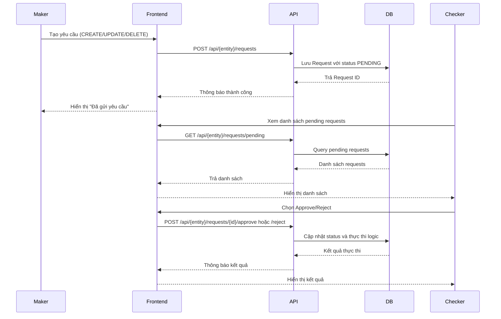

# Hệ Thống Workflow Duyệt (Maker-Checker)  

## 1. Thông tin chung
- **Mã tính năng**: `FT-WORKFLOW-001`  
- **Module liên quan**: Flex.AspNetIdentity.Api, Flex.System.Api, Flex.Notification.Api  
- **Người phụ trách**: Development Team  
- **Ngày viết**: 2025-01-03  
- **Phiên bản**: v1.0

---

## 2. Mục tiêu
Hệ thống workflow duyệt (Maker-Checker) được thiết kế để đảm bảo tính kiểm soát và tuân thủ trong các thao tác quan trọng của hệ thống. Tất cả các thao tác CREATE, UPDATE, DELETE trên các entity quan trọng đều phải trải qua quy trình duyệt hai cấp: Maker (người tạo yêu cầu) và Checker (người duyệt yêu cầu).

**Giá trị mang lại:**
- Đảm bảo tính nhất quán và chính xác của dữ liệu
- Kiểm soát quyền hạn và trách nhiệm rõ ràng
- Audit trail đầy đủ cho các thay đổi quan trọng
- Tuân thủ các quy định về kiểm soát nội bộ

---

## 3. Phạm vi
- **In-scope**: 
  - Quản lý User (tạo, sửa, xóa người dùng)
  - Quản lý Role (tạo, sửa, xóa vai trò)
  - Quản lý Branch (tạo, sửa, xóa chi nhánh)
  - Quản lý NotificationTemplate (tạo, sửa, xóa template)
  - Luồng duyệt: PENDING → APPROVED/REJECTED
  - Audit trail và history tracking

- **Out-of-scope**: 
  - Các thao tác đọc dữ liệu (GET operations)
  - Authentication/Authorization (đã có hệ thống riêng)
  - Real-time notifications (chỉ có basic notification)

---

## 4. Luồng nghiệp vụ
### 4.1 Mô tả tổng quan
Hệ thống workflow hoạt động theo mô hình Maker-Checker với 3 trạng thái chính:
- **PENDING (UNA)**: Yêu cầu đang chờ duyệt
- **APPROVED (AUT)**: Yêu cầu đã được phê duyệt và thực thi
- **REJECTED (REJ)**: Yêu cầu bị từ chối

### 4.2 Các bước chi tiết
1. **Maker** tạo yêu cầu (CREATE/UPDATE/DELETE) → Trạng thái PENDING
2. **Checker** xem xét và quyết định:
   - **Approve**: Thực thi thao tác → Trạng thái APPROVED
   - **Reject**: Từ chối yêu cầu → Trạng thái REJECTED
3. Hệ thống ghi nhận audit trail và cập nhật history



---

## 5. Yêu cầu chức năng
### 5.1 Functional Requirements
| ID | Mô tả | Ưu tiên | Ghi chú |
|----|-------|---------|---------|
| FR-001 | Maker tạo yêu cầu CREATE/UPDATE/DELETE | Cao | Lưu vào bảng {Entity}Requests với status PENDING |
| FR-002 | Checker xem danh sách pending requests | Cao | Phân trang và tìm kiếm theo keyword |
| FR-003 | Checker phê duyệt yêu cầu | Cao | Thực thi logic và cập nhật status APPROVED |
| FR-004 | Checker từ chối yêu cầu | Cao | Cập nhật status REJECTED với lý do |
| FR-005 | Xem chi tiết yêu cầu | Cao | Hiển thị oldData/newData cho UPDATE requests |
| FR-006 | Xem lịch sử thay đổi entity | Trung bình | Audit trail cho tất cả thao tác |
| FR-007 | Validation dữ liệu đầu vào | Cao | FluentValidation cho tất cả DTOs |
| FR-008 | Kiểm tra duplicate requests | Cao | Tránh duplicate pending requests |

### 5.2 Non-Functional Requirements
| ID | Mô tả | Ưu tiên | Metric | Ghi chú |
|----|-------|---------|--------|---------|
| NFR-001 | Performance | Cao | <500ms cho approve/reject operations | Database optimization |
| NFR-002 | Security | Cao | Role-based access control | Permission-based endpoints |
| NFR-003 | Data Integrity | Cao | ACID transactions | Database constraints |
| NFR-004 | Audit Trail | Cao | Complete change history | Immutable audit logs |
| NFR-005 | Scalability | Trung bình | Hỗ trợ >1000 concurrent requests | Connection pooling |

---

## 6. Thiết kế API
### 6.1 Endpoints
**User Management:**
- `POST /api/users/requests` - Tạo yêu cầu user
- `GET /api/users/requests/pending` - Lấy danh sách pending requests
- `GET /api/users/requests/pending/{id}` - Lấy chi tiết request
- `POST /api/users/requests/pending/{id}/approve` - Phê duyệt request
- `POST /api/users/requests/pending/{id}/reject` - Từ chối request

**Role Management:**
- `POST /api/roles/requests` - Tạo yêu cầu role
- `GET /api/roles/requests/pending` - Lấy danh sách pending requests
- `POST /api/roles/requests/pending/{id}/approve` - Phê duyệt request
- `POST /api/roles/requests/pending/{id}/reject` - Từ chối request

**Branch Management:**
- `POST /api/branches/requests` - Tạo yêu cầu branch
- `GET /api/branches/requests/pending` - Lấy danh sách pending requests
- `POST /api/branches/requests/pending/{id}/approve` - Phê duyệt request
- `POST /api/branches/requests/pending/{id}/reject` - Từ chối request

### 6.2 Request Examples
**Create User Request:**
```json
{
  "userName": "john.doe",
  "fullName": "John Doe",
  "email": "john.doe@example.com",
  "phoneNumber": "0123456789",
  "branchId": 1,
  "isActive": true,
  "comments": "Tạo user mới cho phòng IT"
}
```

**Approve Request:**
```json
{
  "comments": "Phê duyệt tạo user mới"
}
```

**Reject Request:**
```json
{
  "rejectionReason": "Thiếu thông tin xác thực"
}
```

### 6.3 Response Examples
**Pending Request List:**
```json
{
  "isSuccess": true,
  "data": {
    "items": [
      {
        "requestId": 123,
        "userName": "john.doe",
        "fullName": "John Doe",
        "requestType": "CREATE",
        "requestedBy": "admin",
        "requestedDate": "2025-01-03T10:30:00Z",
        "status": "PENDING"
      }
    ],
    "totalCount": 1,
    "pageIndex": 1,
    "pageSize": 10
  }
}
```

**Request Detail:**
```json
{
  "isSuccess": true,
  "data": {
    "requestId": 123,
    "type": "CREATE",
    "requestedBy": "admin",
    "requestedDate": "2025-01-03T10:30:00Z",
    "newData": {
      "userName": "john.doe",
      "fullName": "John Doe",
      "email": "john.doe@example.com",
      "branchName": "Hà Nội"
    }
  }
}
```

### 6.4 Error Codes
| Code | Message | Ý nghĩa |
|------|---------|---------|
| 400 | Bad Request | Input validation failed |
| 401 | Unauthorized | Không có quyền truy cập |
| 403 | Forbidden | Không có quyền thực hiện thao tác |
| 404 | Not Found | Request không tồn tại |
| 409 | Conflict | Duplicate request hoặc conflict data |
| 500 | Internal Server Error | Server error |

---

## 7. Database Impact
### 7.1 Cấu trúc Database
**Base Tables:**
- `USERS` - Bảng người dùng chính
- `ROLES` - Bảng vai trò
- `BRANCHES` - Bảng chi nhánh
- `NOTIFICATION_TEMPLATES` - Bảng template thông báo

**Request Tables:**
- `USER_REQUESTS` - Yêu cầu thay đổi user
- `ROLE_REQUESTS` - Yêu cầu thay đổi role  
- `BRANCH_REQUESTS` - Yêu cầu thay đổi branch
- `NOTIFICATION_TEMPLATE_REQUESTS` - Yêu cầu thay đổi template

### 7.2 Schema Design
**RequestBase Table Structure:**
```sql
-- Base structure cho tất cả request tables
CREATE TABLE {ENTITY}_REQUESTS (
    ID NUMBER(19) PRIMARY KEY,
    ENTITY_ID NUMBER(19) NOT NULL,
    ACTION VARCHAR2(20) NOT NULL, -- CREATE, UPDATE, DELETE
    STATUS VARCHAR2(10) DEFAULT 'UNA', -- UNA, AUT, REJ
    REQUESTED_DATA CLOB NOT NULL, -- JSON data
    COMMENTS NVARCHAR2(500),
    MAKER_ID VARCHAR2(256) NOT NULL,
    REQUESTED_DATE TIMESTAMP DEFAULT CURRENT_TIMESTAMP,
    CHECKER_ID VARCHAR2(256),
    APPROVE_DATE TIMESTAMP,
    CREATED_DATE TIMESTAMP DEFAULT CURRENT_TIMESTAMP,
    CREATED_BY VARCHAR2(256),
    UPDATED_DATE TIMESTAMP,
    UPDATED_BY VARCHAR2(256)
);

-- Indexes cho performance
CREATE INDEX IX_{ENTITY}_REQUESTS_STATUS ON {ENTITY}_REQUESTS(STATUS);
CREATE INDEX IX_{ENTITY}_REQUESTS_ENTITY_ID ON {ENTITY}_REQUESTS(ENTITY_ID);
CREATE INDEX IX_{ENTITY}_REQUESTS_MAKER_ID ON {ENTITY}_REQUESTS(MAKER_ID);
CREATE INDEX IX_{ENTITY}_REQUESTS_REQUESTED_DATE ON {ENTITY}_REQUESTS(REQUESTED_DATE);
```

**Entity Tables với Status:**
```sql
-- Tất cả entity tables đều có cột STATUS
ALTER TABLE USERS ADD STATUS VARCHAR2(3) DEFAULT 'AUT';
ALTER TABLE ROLES ADD STATUS VARCHAR2(3) DEFAULT 'AUT';
ALTER TABLE BRANCHES ADD STATUS VARCHAR2(3) DEFAULT 'AUT';

-- Indexes cho STATUS
CREATE INDEX IX_USERS_STATUS ON USERS(STATUS);
CREATE INDEX IX_ROLES_STATUS ON ROLES(STATUS);
CREATE INDEX IX_BRANCHES_STATUS ON BRANCHES(STATUS);
```

### 7.3 Data Flow
1. **CREATE Request**: `ENTITY_ID = 0`, `REQUESTED_DATA` chứa data mới
2. **UPDATE Request**: `ENTITY_ID = actual_id`, `REQUESTED_DATA` chứa oldData + newData
3. **DELETE Request**: `ENTITY_ID = actual_id`, `REQUESTED_DATA` chứa snapshot data

---

## 8. UI/UX Design Guidelines
### 8.1 Visual Design
- **Màu sắc**: 
  - Pending: #ffc107 (Warning - Vàng)
  - Approved: #28a745 (Success - Xanh lá)
  - Rejected: #dc3545 (Danger - Đỏ)
  - Primary: #007bff (Bootstrap blue)

### 8.2 User Experience
- **Pending Requests List**: 
  - Hiển thị badge màu theo trạng thái
  - Icon phân biệt loại request (CREATE/UPDATE/DELETE)
  - Search và filter theo keyword
- **Request Detail Modal**: 
  - Side-by-side comparison cho UPDATE requests
  - Highlight các field thay đổi
  - Loading states khi approve/reject
- **Action Buttons**: 
  - Approve: Màu xanh với icon check
  - Reject: Màu đỏ với icon X
  - Disabled state khi đang xử lý

### 8.3 Responsive Design
- **Desktop**: Table layout với đầy đủ thông tin
- **Tablet**: Card layout với thông tin cơ bản
- **Mobile**: List layout với action buttons

### 8.4 Accessibility
- ARIA labels cho screen readers
- Keyboard navigation support
- High contrast mode support
- Focus indicators rõ ràng

---

## 9. Logging & Audit
### 9.1 Log Format
```json
{
  "timestamp": "2025-01-03T10:30:00Z",
  "level": "INFO",
  "message": "User request approved",
  "requestId": "123",
  "entityType": "USER",
  "action": "CREATE",
  "makerId": "admin",
  "checkerId": "supervisor",
  "ipAddress": "192.168.1.100",
  "userAgent": "Mozilla/5.0...",
  "correlationId": "abc-123-def",
  "success": true
}
```

### 9.2 Log Levels
- **ERROR**: Request processing failures, system errors
- **WARN**: Validation failures, suspicious activity
- **INFO**: Successful approve/reject operations
- **DEBUG**: Detailed request/response data

### 9.3 Audit Trail Fields
| Field | Type | Required | Description |
|-------|------|----------|-------------|
| requestId | NUMBER(19) | Yes | ID của request |
| entityType | VARCHAR2(50) | Yes | Loại entity (USER, ROLE, BRANCH) |
| action | VARCHAR2(20) | Yes | Action performed (CREATE, UPDATE, DELETE) |
| makerId | VARCHAR2(256) | Yes | ID của người tạo request |
| checkerId | VARCHAR2(256) | No | ID của người duyệt request |
| requestedData | CLOB | Yes | Dữ liệu request (JSON) |
| status | VARCHAR2(10) | Yes | Trạng thái cuối cùng |
| timestamp | TIMESTAMP | Yes | Thời gian thực hiện action |
| ipAddress | VARCHAR2(45) | Yes | IP address của client |
| userAgent | VARCHAR2(500) | No | Browser/client information |

### 9.4 Retention Policy
- **Request History**: 2 năm
- **Audit Logs**: 3 năm
- **Error Logs**: 6 tháng

---

## 10. Test Cases
### 10.1 Functional Tests
| ID | Test Case | Input | Expected Output | Priority |
|----|-----------|-------|-----------------|----------|
| TC-001 | Tạo CREATE request thành công | Valid user data | Request với status PENDING | High |
| TC-002 | Approve CREATE request | Valid request ID | User được tạo, status APPROVED | High |
| TC-003 | Reject CREATE request | Valid request ID + reason | Status REJECTED, user không được tạo | High |
| TC-004 | Tạo UPDATE request | Valid update data | Request với oldData + newData | High |
| TC-005 | Approve UPDATE request | Valid request ID | Entity được cập nhật | High |
| TC-006 | Tạo DELETE request | Valid entity ID | Request với snapshot data | High |
| TC-007 | Approve DELETE request | Valid request ID | Entity bị xóa | High |
| TC-008 | Duplicate request validation | Same data pending | Error message | High |
| TC-009 | Invalid request ID | Non-existent ID | 404 Not Found | Medium |
| TC-010 | Unauthorized access | Invalid permissions | 403 Forbidden | High |

### 10.2 Performance Tests
| ID | Test Case | Load | Expected Response Time | Priority |
|----|-----------|------|----------------------|----------|
| PT-001 | Load test approve/reject | 100 concurrent operations | <500ms average | High |
| PT-002 | Load test pending list | 1000 concurrent requests | <200ms average | Medium |
| PT-003 | Volume test | 10,000 requests/hour | 99.9% success rate | Medium |

### 10.3 Security Tests
| ID | Test Case | Description | Expected Result | Priority |
|----|-----------|-------------|-----------------|----------|
| ST-001 | SQL Injection | Malicious input in comments | Input sanitized | High |
| ST-002 | XSS Attack | Script in request data | Input escaped | High |
| ST-003 | Authorization bypass | Direct API calls | Proper permission check | High |
| ST-004 | Data tampering | Modify request data | Validation prevents | High |

### 10.4 Integration Tests
| ID | Test Case | Description | Expected Result | Priority |
|----|-----------|-------------|-----------------|----------|
| IT-001 | User workflow end-to-end | CREATE → APPROVE → Verify | User created successfully | High |
| IT-002 | Role workflow end-to-end | UPDATE → APPROVE → Verify | Role updated successfully | High |
| IT-003 | Branch workflow end-to-end | DELETE → APPROVE → Verify | Branch deleted successfully | High |
| IT-004 | Cross-module integration | User with branch reference | Data consistency maintained | Medium |

---

## 11. Security Considerations
### 11.1 OWASP Top 10 Compliance
- **A01 - Broken Access Control**: Role-based permissions cho approve/reject
- **A02 - Cryptographic Failures**: HTTPS only, secure data transmission
- **A03 - Injection**: Parameterized queries, input validation
- **A04 - Insecure Design**: Maker-Checker pattern prevents unauthorized changes
- **A05 - Security Misconfiguration**: Proper CORS, security headers
- **A07 - Identification Failures**: Audit trail cho tất cả operations

### 11.2 Authorization Security
- Permission-based access control cho từng endpoint
- Maker chỉ có thể tạo request, không thể approve
- Checker chỉ có thể approve/reject, không thể tạo request
- Admin có thể thực hiện tất cả operations

### 11.3 Data Security
- Sensitive data được hash/encrypt khi cần thiết
- Request data được validate và sanitize
- Audit trail không thể bị modify
- Database constraints đảm bảo data integrity

### 11.4 Network Security
- HTTPS only (TLS 1.2+)
- CORS configuration
- Security headers (HSTS, CSP, X-Frame-Options)
- Rate limiting cho approve/reject operations

---

## 12. Monitoring & Alerting
### 12.1 Metrics
- Request approval rate
- Average processing time
- Error rate by operation type
- Pending requests count
- Maker/Checker activity patterns

### 12.2 Alerts
- **Critical**: Approval rate < 80%
- **Warning**: Processing time > 1 second
- **Info**: High volume of pending requests
- **Critical**: System errors in workflow processing

### 12.3 Health Checks
- Database connectivity
- Request processing pipeline
- External service availability
- Cache performance

---

## 13. Deployment & Rollback
### 13.1 Deployment Strategy
- Blue-green deployment
- Database migration compatibility
- Feature flags for gradual rollout
- Zero-downtime deployment

### 13.2 Rollback Plan
- Database rollback scripts
- Application version rollback
- Configuration rollback
- Data consistency checks

---

## 14. Rủi ro & Giải pháp
| Rủi ro | Impact | Probability | Mitigation |
|--------|--------|-------------|------------|
| Request bị stuck ở PENDING | High | Medium | Auto-timeout, manual intervention |
| Duplicate requests | Medium | High | Validation logic, unique constraints |
| Data inconsistency | High | Low | ACID transactions, constraints |
| Performance degradation | Medium | Medium | Database optimization, caching |
| Security breach | High | Low | Audit logging, permission controls |

---

## 15. Tài liệu tham khảo
- [Flex Microservice Architecture](docs/architecture.md)
- [Entity Management Workflow](docs/agents/ENTITY_MANAGEMENT_WORKFLOW.md)
- [API Documentation](docs/apis/)
- [Database Schema](flex-database/)
- [Frontend Components](flex-microfrontend/src/app/pages/system/)

---

## 16. Changelog
| Version | Date | Changes | Author |
|---------|------|---------|--------|
| v1.0 | 2025-01-03 | Initial workflow documentation | Development Team |

---
