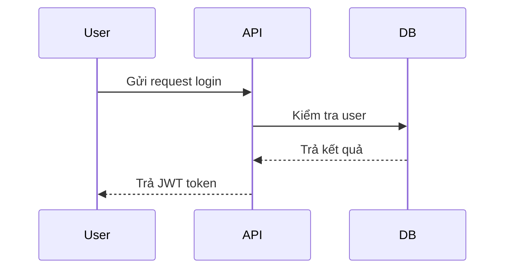

# [Tên Tính Năng]  

## 1. Thông tin chung
- **Mã tính năng**: `FT-XXX`  
- **Module liên quan**: [Tên module]  
- **Người phụ trách**: [Dev/BA/QA]  
- **Ngày viết**: YYYY-MM-DD  
- **Phiên bản**: v1.0

---

## 2. Mục tiêu
Mô tả ngắn gọn **mục đích của tính năng** này, giải quyết vấn đề gì, giá trị mang lại cho người dùng/hệ thống.  

---

## 3. Phạm vi
- **In-scope**: Những gì tính năng này sẽ xử lý.  
- **Out-of-scope**: Những gì sẽ không nằm trong phạm vi (tránh hiểu nhầm).  

---

## 4. Luồng nghiệp vụ
### 4.1 Mô tả tổng quan
Sơ đồ hoặc text mô tả luồng hoạt động chính.  

### 4.2 Các bước chi tiết
1. Người dùng [hành động]  
2. Hệ thống [xử lý]  
3. [Kết quả]  



---

## 5. Yêu cầu chức năng
### 5.1 Functional Requirements
| ID | Mô tả | Ưu tiên | Ghi chú |
|----|-------|---------|---------|
| FR-001 | Người dùng đăng nhập bằng username/password | Cao | Validate theo chính sách password |
| FR-002 | Sinh JWT token với claim role | Cao | Expire sau 15 phút |
| FR-003 | Refresh token khi access token hết hạn | Trung bình | Refresh token expire sau 7 ngày |

### 5.2 Non-Functional Requirements
| ID | Mô tả | Ưu tiên | Metric | Ghi chú |
|----|-------|---------|--------|---------|
| NFR-001 | Performance | Cao | <200ms cho request login | Benchmark |
| NFR-002 | Security | Cao | OWASP Top 10 compliance | Rate limiting, input validation |
| NFR-003 | Scalability | Trung bình | Hỗ trợ >1000 concurrent users | Load balancing |
| NFR-004 | Monitoring | Trung bình | 99.9% uptime | Health check, alerting |
| NFR-005 | Availability | Cao | 24/7 operation | Backup, disaster recovery |

---

## 6. Thiết kế API (nếu có)
### 6.1 Endpoint
- `POST /api/v1/auth/login`
- `POST /api/v1/auth/refresh`
- `POST /api/v1/auth/logout`

### 6.2 Request
```json
{
  "username": "string",
  "password": "string"
}
```

### 6.3 Response
```json
{
  "accessToken": "string",
  "refreshToken": "string",
  "expiresIn": 900,
  "tokenType": "Bearer"
}
```

### 6.4 Error Codes
| Code | Message | Ý nghĩa |
|------|---------|---------|
| 400 | Bad Request | Input validation failed |
| 401 | Unauthorized | Sai username/password |
| 403 | Forbidden | Tài khoản bị khóa |
| 429 | Too Many Requests | Rate limit exceeded |
| 500 | Internal Server Error | Server error |

### 6.5 Rate Limiting
- Login attempts: 5 requests/minute per IP
- Token refresh: 10 requests/minute per user

---

## 7. Database Impact
### 7.1 Bảng mới
```sql
CREATE TABLE UserLoginHistory (
    Id NUMBER(19) PRIMARY KEY,
    UserId NUMBER(19) NOT NULL,
    LoginDate TIMESTAMP DEFAULT CURRENT_TIMESTAMP,
    IpAddress VARCHAR2(45),
    UserAgent VARCHAR2(500),
    IsSuccess CHAR(1) DEFAULT 'N',
    FailureReason VARCHAR2(200),
    CONSTRAINT FK_UserLoginHistory_Users FOREIGN KEY (UserId) REFERENCES Users(Id)
);

-- Index cho performance
CREATE INDEX IX_UserLoginHistory_UserId ON UserLoginHistory(UserId);
CREATE INDEX IX_UserLoginHistory_LoginDate ON UserLoginHistory(LoginDate);
```

### 7.2 Cột mới
```sql
-- Bảng Users
ALTER TABLE Users ADD LastLoginDate TIMESTAMP;
ALTER TABLE Users ADD LoginAttemptCount NUMBER(3) DEFAULT 0;
ALTER TABLE Users ADD LockoutEndDate TIMESTAMP;

-- Index cho performance
CREATE INDEX IX_Users_LastLoginDate ON Users(LastLoginDate);
```

### 7.3 Migration Script
- File: `/migrations/V1.1__add_login_history.sql`
- Rollback: `/migrations/V1.1__rollback_login_history.sql`

---

## 8. UI/UX Design Guidelines
### 8.1 Visual Design
- **Màu sắc**: 
  - Primary: #007bff (Bootstrap blue)
  - Success: #28a745 (Green)
  - Error: #dc3545 (Red)
  - Warning: #ffc107 (Yellow)

### 8.2 User Experience
- **Loading States**: Hiển thị spinner khi đang xử lý login
- **Error Messages**: 
  - Hiển thị lỗi validation ngay dưới field
  - Toast notification cho lỗi server
- **Success Feedback**: 
  - Toast notification "Đăng nhập thành công"
  - Redirect sau 2 giây

### 8.3 Responsive Design
- **Mobile**: Form full-width, button lớn hơn
- **Tablet**: Form centered, max-width 400px
- **Desktop**: Form left-aligned, max-width 350px

### 8.4 Accessibility
- ARIA labels cho screen readers
- Keyboard navigation support
- High contrast mode support

---

## 9. Logging & Audit
### 9.1 Log Format
```json
{
  "timestamp": "2025-01-03T10:30:00Z",
  "level": "INFO",
  "message": "User login attempt",
  "userId": "12345",
  "ipAddress": "192.168.1.100",
  "userAgent": "Mozilla/5.0...",
  "correlationId": "abc-123-def",
  "action": "LOGIN_ATTEMPT",
  "success": true
}
```

### 9.2 Log Levels
- **ERROR**: Login failures, system errors
- **WARN**: Rate limit exceeded, suspicious activity
- **INFO**: Successful login, token refresh
- **DEBUG**: Detailed request/response data

### 9.3 Audit Trail Fields
| Field | Type | Required | Description |
|-------|------|----------|-------------|
| userId | NUMBER(19) | Yes | ID của user thực hiện action |
| ipAddress | VARCHAR2(45) | Yes | IP address của client |
| userAgent | VARCHAR2(500) | No | Browser/client information |
| action | VARCHAR2(50) | Yes | Action performed (LOGIN, LOGOUT, etc.) |
| timestamp | TIMESTAMP | Yes | Thời gian thực hiện action |
| success | CHAR(1) | Yes | Y/N - thành công hay không |
| failureReason | VARCHAR2(200) | No | Lý do thất bại nếu có |

### 9.4 Retention Policy
- **Login History**: 90 ngày
- **Audit Logs**: 1 năm
- **Error Logs**: 30 ngày

---

## 10. Test Cases
### 10.1 Functional Tests
| ID | Test Case | Input | Expected Output | Priority |
|----|-----------|-------|-----------------|----------|
| TC-001 | Login thành công | user/pass hợp lệ | Trả JWT token | High |
| TC-002 | Login sai password | pass sai | 401 Unauthorized | High |
| TC-003 | Login user locked | user locked | 403 Forbidden | High |
| TC-004 | Login với username rỗng | username="" | 400 Bad Request | Medium |
| TC-005 | Login với password quá ngắn | pass="12" | 400 Bad Request | Medium |
| TC-006 | SQL Injection attempt | username="'; DROP TABLE Users; --" | 400 Bad Request | High |
| TC-007 | XSS attempt | username="<script>alert('xss')</script>" | 400 Bad Request | High |

### 10.2 Performance Tests
| ID | Test Case | Load | Expected Response Time | Priority |
|----|-----------|------|----------------------|----------|
| PT-001 | Load test | 100 concurrent users | <200ms average | High |
| PT-002 | Stress test | 1000 concurrent users | <500ms average | Medium |
| PT-003 | Volume test | 10,000 requests/hour | 99.9% success rate | Medium |

### 10.3 Security Tests
| ID | Test Case | Description | Expected Result | Priority |
|----|-----------|-------------|-----------------|----------|
| ST-001 | Brute force attack | 100 failed attempts | Account locked | High |
| ST-002 | Rate limiting | 10 requests/second | 429 Too Many Requests | High |
| ST-003 | Session hijacking | Token manipulation | 401 Unauthorized | High |

### 10.4 Cross-Browser Tests
| Browser | Version | Status | Notes |
|---------|--------|--------|-------|
| Chrome | Latest | ✅ | Primary browser |
| Firefox | Latest | ✅ | Secondary browser |
| Safari | Latest | ✅ | macOS users |
| Edge | Latest | ✅ | Windows users |

### 10.5 Mobile Tests
| Device | OS | Status | Notes |
|--------|----|----|-------|
| iPhone | iOS 15+ | ✅ | Touch interface |
| Android | API 30+ | ✅ | Various screen sizes |

---

## 11. Security Considerations
### 11.1 OWASP Top 10 Compliance
- **A01 - Broken Access Control**: JWT token validation
- **A02 - Cryptographic Failures**: HTTPS only, secure password hashing
- **A03 - Injection**: Parameterized queries, input validation
- **A07 - Identification Failures**: Rate limiting, account lockout

### 11.2 Authentication Security
- Password hashing: bcrypt with salt
- JWT secret: Environment variable, rotated monthly
- Session timeout: 15 minutes inactivity
- Multi-factor authentication: Optional for admin users

### 11.3 Network Security
- HTTPS only (TLS 1.2+)
- CORS configuration
- Security headers (HSTS, CSP, X-Frame-Options)

---

## 12. Monitoring & Alerting
### 12.1 Metrics
- Login success rate
- Average response time
- Error rate by endpoint
- Active user sessions

### 12.2 Alerts
- **Critical**: Login success rate < 95%
- **Warning**: Response time > 500ms
- **Info**: Unusual login patterns

### 12.3 Health Checks
- Database connectivity
- JWT token validation
- External service availability

---

## 13. Deployment & Rollback
### 13.1 Deployment Strategy
- Blue-green deployment
- Database migration compatibility
- Feature flags for gradual rollout

### 13.2 Rollback Plan
- Database rollback scripts
- Application version rollback
- Configuration rollback

---

## 14. Rủi ro & Giải pháp
| Rủi ro | Impact | Probability | Mitigation |
|--------|--------|-------------|------------|
| Token bị lộ | High | Medium | HTTPS, short expiry, refresh token |
| Brute force attack | Medium | High | Rate limiting, account lockout |
| Database overload | High | Low | Connection pooling, caching |
| Third-party service down | Medium | Medium | Circuit breaker, fallback |

---

## 15. Tài liệu tham khảo
- [Link Jira/Trello task]  
- [Link API Spec tổng thể]  
- [Link FSD/HLD]  
- [OWASP Authentication Cheat Sheet](https://cheatsheetseries.owasp.org/cheatsheets/Authentication_Cheat_Sheet.html)
- [JWT Best Practices](https://tools.ietf.org/html/rfc8725)

---

## 16. Changelog
| Version | Date | Changes | Author |
|---------|------|---------|--------|
| v1.0 | 2025-01-03 | Initial version | [Author] |

---
