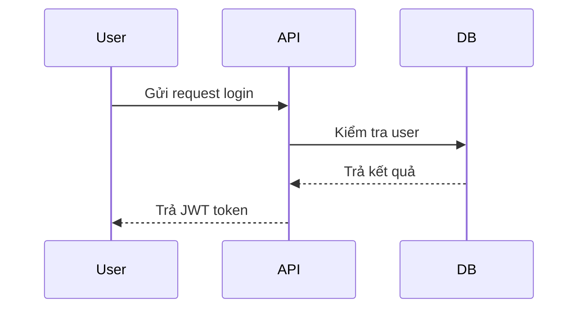

# [Tên Tính Năng]  

## 1. Thông tin chung
- **Mã tính năng**: `FT-XXX`  
- **Module liên quan**: [Tên module]  
- **Người phụ trách**: [Dev/BA/QA]  
- **Ngày viết**: YYYY-MM-DD  

---

## 2. Mục tiêu
Mô tả ngắn gọn **mục đích của tính năng** này, giải quyết vấn đề gì, giá trị mang lại cho người dùng/hệ thống.  

---

## 3. Phạm vi
- **In-scope**: Những gì tính năng này sẽ xử lý.  
- **Out-of-scope**: Những gì sẽ không nằm trong phạm vi (tránh hiểu nhầm).  

---

## 4. Luồng nghiệp vụ
### 4.1 Mô tả tổng quan
Sơ đồ hoặc text mô tả luồng hoạt động chính.  

### 4.2 Các bước chi tiết
1. Người dùng [hành động]  
2. Hệ thống [xử lý]  
3. [Kết quả]  



---

## 5. Yêu cầu chức năng
| ID | Mô tả | Ưu tiên | Loại | Ghi chú |
|----|-------|---------|------|---------|
| FR-001 | Người dùng đăng nhập bằng username/password | Cao | Functional | Validate theo chính sách password |
| FR-002 | Sinh JWT token với claim role | Cao | Functional | Expire sau 15 phút |
| NFR-001 | Đáp ứng <200ms cho request login | Trung bình | Non-Functional | Benchmark |

---

## 6. Thiết kế API (nếu có)
### 6.1 Endpoint
- `POST /api/v1/auth/login`

### 6.2 Request
```json
{
  "username": "string",
  "password": "string"
}
```

### 6.3 Response
```json
{
  "accessToken": "string",
  "refreshToken": "string",
  "expiresIn": 900
}
```

### 6.4 Error Codes
| Code | Message | Ý nghĩa |
|------|---------|---------|
| 401 | Unauthorized | Sai username/password |
| 403 | Forbidden | Tài khoản bị khóa |

---

## 7. Database Impact
- Bảng mới: `UserLoginHistory`  
- Cột mới: `LastLoginDate` trong `Users`  
- Migration script: `/migrations/20251003_add_login_history.sql`

---

## 8. UI/UX (nếu có giao diện)
- Wireframe / Mockup  
- Quy tắc hiển thị thông báo lỗi/thành công  

---

## 9. Logging & Audit
- Log event đăng nhập thành công/thất bại  
- Lưu audit trail cho user login  

---

## 10. Test Case Gợi Ý
| ID | Test Case | Input | Expected Output |
|----|-----------|-------|-----------------|
| TC-001 | Login thành công | user/pass hợp lệ | Trả JWT token |
| TC-002 | Login sai pass | pass sai | 401 Unauthorized |
| TC-003 | Login user locked | user locked | 403 Forbidden |

---

## 11. Rủi ro & Giải pháp
- **Rủi ro**: Token bị lộ  
- **Giải pháp**: Dùng HTTPS, JWT expire ngắn, refresh token  

---

## 12. Tài liệu tham khảo
- [Link Jira/Trello task]  
- [Link API Spec tổng thể]  
- [Link FSD/HLD]  

---
