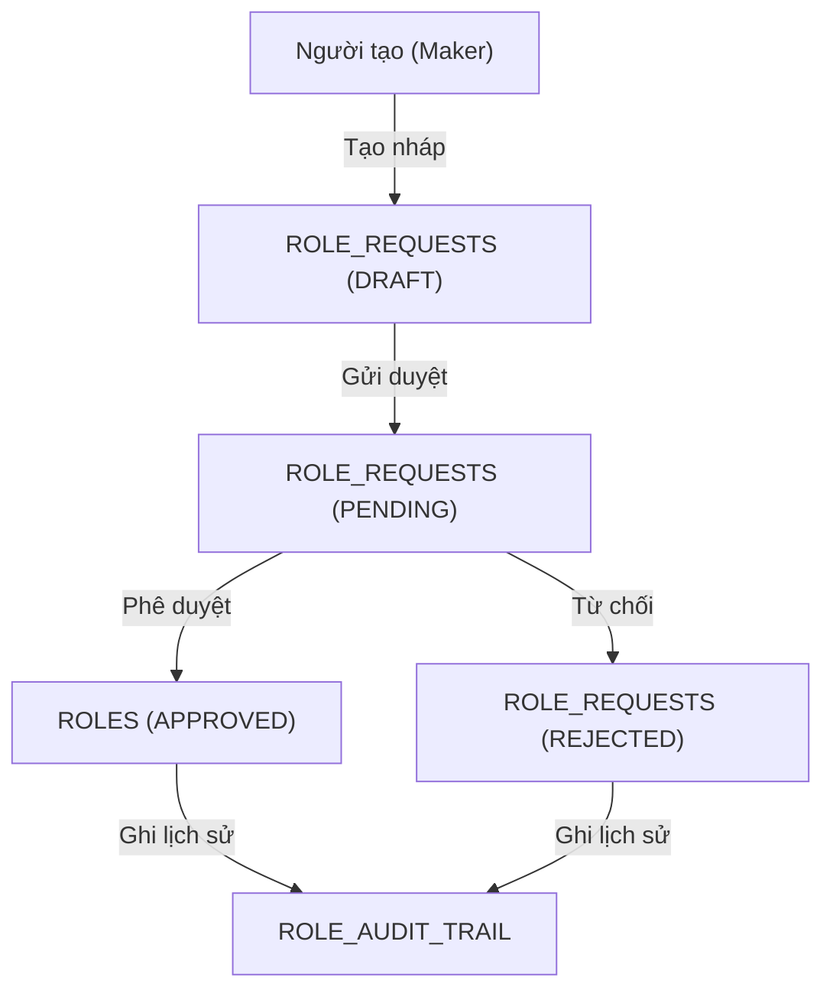

# Tóm tắt mục tiêu

Tài liệu này hướng dẫn cách quản lý bản chính và bản nháp trong hệ thống quản trị nội bộ chứng khoán, đảm bảo quy trình kiểm soát (maker-checker), tách biệt dữ liệu nháp và dữ liệu chính thức, hỗ trợ phê duyệt, truy vết và hiển thị minh bạch.

---

# Flowchart quy trình quản lý bản nháp/phê duyệt

---

# Tổng quan về quản lý bản chính và bản nháp trong hệ thống quản trị nội bộ chứng khoán

Trong các hệ thống quản trị nội bộ lĩnh vực chứng khoán, việc xử lý luồng hiển thị danh sách đối tượng có bản chính và bản nháp (có thể có nhiều bản nháp từ nhiều người) là một yêu cầu phổ biến, đặc biệt khi áp dụng quy trình duyệt (maker-checker). Tài liệu này trình bày các phương pháp thực tế về phân quyền, hiển thị, và quản lý dữ liệu bản chính/bản nháp trong các hệ thống này.

# Quản Lý Bản Nháp vs Bản Chính và Cách Hiển Thị Danh Sách

## Tổng Quan Về Bản Nháp và Bản Chính

Trong hệ thống nội bộ (ví dụ hệ thống quản lý chi nhánh cho công ty chứng khoán), mỗi mục dữ liệu có thể tồn tại ở hai trạng thái:

* **Bản chính (đã phê duyệt):** Dữ liệu chính thức đang có hiệu lực.
* **Bản nháp (chờ duyệt):** Phiên bản sửa đổi hoặc tạo mới, chưa được phê duyệt.

Điều quan trọng là **dữ liệu bản chính vẫn được sử dụng cho đến khi bản nháp được phê duyệt**. Nói cách khác, nếu có bản nháp đang chờ, người dùng thông thường vẫn thấy thông tin **bản chính hiện tại**, còn bản nháp chỉ hiển thị cho người liên quan đến việc chỉnh sửa/phê duyệt. Ví dụ, trong một CMS, khi bài viết có bản nháp, người xem chỉ thấy phiên bản đã xuất bản, còn khi người chỉnh sửa vào bài viết đó thì mới thấy nội dung bản nháp cùng tùy chọn tiếp tục lưu nháp hoặc xuất bản. Điều này đảm bảo **chỉ nội dung đã được phê duyệt mới được chia sẻ rộng rãi**.

Nếu một bản ghi chưa từng được phê duyệt (ví dụ một chi nhánh mới tạo ở trạng thái nháp), thì trước khi phê duyệt nó thường **không xuất hiện như dữ liệu chính thức** cho người dùng thông thường. Chỉ những người có quyền (tác giả nháp, người phê duyệt, quản trị) mới thấy hoặc truy cập được bản ghi nháp này.

## Cách Hiển Thị Danh Sách Khi Có Bản Nháp

Hệ thống thường có hai cách phổ biến để xử lý việc hiển thị danh sách khi tồn tại bản nháp:

### 1. **Hiển Thị Bản Chính Kèm Trạng Thái Nháp**

Trong danh sách quản lý (ví dụ danh sách chi nhánh), mỗi dòng đại diện cho một bản ghi chính thức. **Thông tin hiển thị mặc định là của bản chính**, ngay cả khi có bản nháp đang chờ duyệt. Tuy nhiên, hệ thống sẽ **đánh dấu hoặc thêm cột trạng thái** để người quản trị biết bản ghi đó có thay đổi chưa duyệt:

* Nhiều hệ thống bổ sung cột “Trạng thái” (Status) cho biết mỗi mục là Đã phê duyệt, Đang chờ duyệt, Nháp… Ví dụ, SharePoint khi bật tính năng phê duyệt nội dung sẽ thêm cột **Approval Status** trong danh sách, giúp người dùng thấy mục nào **Pending** (đang chờ) hay **Approved** (đã phê duyệt).
* Bản ghi có nháp thường được gắn nhãn như “(Có bản nháp)” hoặc biểu tượng cảnh báo trong danh sách. Điều này thông báo cho quản trị viên rằng **đang có thay đổi chờ phê duyệt** trên bản ghi đó.
* Khi click vào bản ghi, người có quyền có thể xem chi tiết bản nháp hoặc so sánh sự khác biệt. Người chỉnh sửa hoặc người duyệt sẽ thấy nội dung bản nháp khi vào chế độ chỉnh sửa, trong khi người xem bình thường thấy nội dung đã duyệt hiện tại.

**Ưu điểm:** Danh sách gọn gàng (mỗi bản ghi chỉ một dòng), luôn phản ánh dữ liệu chính thức nhất quán. Người quản trị vẫn nhận biết được chỗ nào có thay đổi chờ duyệt mà không cần danh sách riêng.

### 2. **Tách Riêng Mục Nháp/Pending Trong Danh Sách Phê Duyệt**

Nhiều hệ thống (đặc biệt trong lĩnh vực tài chính/chứng khoán) áp dụng mô hình **Maker-Checker** (Người tạo - Người duyệt). Theo mô hình này, các nội dung chờ duyệt được quản lý tách biệt:

* Danh sách chính chỉ liệt kê các **bản ghi đã phê duyệt**. Bản nháp **không xuất hiện** trong danh sách chính thức cho đến khi được duyệt, nhằm tránh nhầm lẫn.
* Song song đó, có một **mục hoặc trang “Yêu cầu phê duyệt”** dành riêng cho người duyệt. Trang này liệt kê **toàn bộ các yêu cầu đang chờ phê duyệt**, bao gồm chi tiết bản nháp. Ví dụ, hệ thống Trackier cung cấp mục “Approval Requests” cho phép người duyệt thấy **danh sách tất cả yêu cầu chờ, đã từ chối hoặc đã phê duyệt**. Mỗi thay đổi nháp được liệt kê với thông tin ai tạo, thay đổi gì.
* Trong danh sách phê duyệt đó, người duyệt có thể click vào từng yêu cầu để **xem chi tiết gốc và thay đổi được đề xuất**. Hệ thống sẽ hiển thị song song **thông tin gốc (bản chính hiện tại)** và **thông tin mới (bản nháp đề xuất)** để người duyệt so sánh.
* Sau khi xem xét, người duyệt có thể **phê duyệt hoặc từ chối** ngay tại danh sách này. Nếu phê duyệt, hệ thống sẽ cập nhật bản chính bằng dữ liệu bản nháp (ví dụ: “sau khi approve, thay đổi sẽ xuất hiện trong dữ liệu chi nhánh chính thức”). Nếu từ chối, bản nháp bị hủy bỏ và không ảnh hưởng dữ liệu chính.

**Ưu điểm:** Rõ ràng minh bạch trong quy trình. Nhân viên bình thường chỉ thấy dữ liệu đã duyệt; còn người quản trị dễ dàng theo dõi các mục đang chờ trong một nơi tập trung. Cách này cũng phù hợp với yêu cầu kiểm soát nội bộ nghiêm ngặt của hệ thống tài chính. (Ví dụ: Các công ty chứng khoán thường yêu cầu **một người nhập liệu, một người khác duyệt**; dữ liệu chỉ chính thức sau khi người duyệt chấp thuận).

### 3. **Xử Lý Trường Hợp Nhiều Bản Nháp**

Một bản ghi “chi nhánh” thường chỉ nên có **một bản nháp chờ duyệt tại một thời điểm** để tránh xung đột. Thông thường hệ thống sẽ khóa hoặc ngăn không cho tạo bản nháp mới nếu cùng bản ghi đang có thay đổi chờ. Điều này đơn giản hóa việc hiển thị: mỗi bản ghi tối đa một trạng thái nháp.

Trường hợp hệ thống cho phép nhiều bản nháp (ví dụ nhiều đề xuất chỉnh sửa song song bởi nhiều người), cách xử lý phổ biến là xem mỗi bản nháp như một **yêu cầu độc lập** trong hàng đợi phê duyệt. Danh sách phê duyệt sẽ có nhiều mục liên quan đến cùng một chi nhánh, mỗi mục ghi rõ người tạo và nội dung thay đổi đề xuất. Tuy nhiên, đây **không phải cách phổ biến** vì phức tạp trong việc hợp nhất dữ liệu. Đa số hệ thống hạn chế điều này bằng quy tắc kinh doanh (ví dụ: phải duyệt hoặc hủy nháp hiện tại trước khi có thể tạo nháp mới cho cùng bản ghi).

**Lưu ý kỹ thuật:** Về cấu trúc dữ liệu, nhiều hệ thống sử dụng cột trạng thái hoặc bảng phiên bản để quản lý bản nháp:

* Cách đơn giản và linh hoạt là thêm trường trạng thái (Draft/Pending/Approved…) ngay trong bảng dữ liệu, có thể thêm khóa ngoại tự tham chiếu nếu cần liên kết bản nháp với bản chính gốc. Cách này cho phép lưu đồng thời bản chính và bản nháp của cùng một đối tượng. Thực tế, một bản ghi đã duyệt sẽ có status “published”; khi tạo bản nháp, hệ thống thêm một dòng mới với status “draft” và tham chiếu tới bản gốc, giúp **cả hai phiên bản cùng tồn tại song song** (bản chính phục vụ hiển thị chung, bản nháp phục vụ cho người duyệt).
* Khi hiển thị danh sách “Tất cả”, hệ thống chỉ truy vấn những bản ghi ở trạng thái đã duyệt (published) để hiển thị. Bản nháp (draft/pending) chỉ được truy xuất trong giao diện phê duyệt hoặc cho người có quyền. Như mô tả trên StackOverflow: *“Nếu một bài viết có bản nháp, người dùng sẽ thấy phiên bản đã xuất bản; còn khi chỉnh sửa thì sẽ thấy phiên bản nháp”*. Điều này áp dụng tương tự cho quản lý chi nhánh: danh sách chi nhánh thông thường hiển thị thông tin chi nhánh đã được duyệt, còn bản nháp thay đổi (nếu có) chỉ hiển thị trong màn hình duyệt hoặc ghi chú trạng thái.

## Thực Tế Áp Dụng Trong Hệ Thống Chứng Khoán/TCNH

Trong các hệ thống tài chính – chứng khoán, việc tách bạch bản nháp và bản chính càng được chú trọng do yêu cầu kiểm soát nội bộ và tuân thủ quy định:

* **Quy trình Maker-Checker:** Mọi thay đổi (mở chi nhánh mới, sửa thông tin chi nhánh, v.v.) đều phải do **Maker (người khởi tạo)** nhập nháp và **Checker (người phê duyệt)** duyệt. Trước khi Checker phê duyệt, thay đổi nằm ở trạng thái “Pending” và **chưa ảnh hưởng đến dữ liệu chính thức**. Người dùng khác chỉ thấy thông tin cũ cho đến khi cập nhật được phê duyệt.
* **Giao diện quản trị phổ biến:** Hầu hết hệ thống cho phép người quản trị xem danh sách chi nhánh chính thức, kèm theo bộ lọc hoặc tab để xem **“Các thay đổi chờ duyệt”**. Ví dụ, một số phần mềm quản trị sẽ có menu **Approval Requests/Pending Changes** hiển thị riêng mọi thay đổi chờ phê duyệt trên toàn hệ thống. Người quản trị cấp cao có thể vào đó để duyệt cùng lúc nhiều thay đổi.
* **Trạng thái rõ ràng:** Mỗi bản ghi hoặc yêu cầu đều ghi trạng thái “Đang chờ duyệt”, “Đã duyệt”, “Đã từ chối”. Khi một thay đổi chi nhánh được duyệt, trạng thái chuyển thành đã duyệt và thay đổi đó cập nhật vào dữ liệu chi nhánh; nếu bị từ chối thì dữ liệu chi nhánh giữ nguyên bản cũ.

**Tóm lại**, phương pháp **phổ biến nhất** là: **Danh sách chính luôn hiển thị dữ liệu bản chính đã phê duyệt**, đảm bảo tính nhất quán và tránh nhầm lẫn. Các bản nháp được quản lý thông qua **trạng thái hoặc danh sách phụ** dành cho người duyệt. Cách tiếp cận này cho phép nhiều người cùng làm việc trên bản nháp **mà không ảnh hưởng đến dữ liệu chung cho đến khi có phê duyệt cuối cùng**. Nhờ đó, hệ thống vừa hỗ trợ quy trình cộng tác (nhiều người có thể đề xuất chỉnh sửa) vừa tuân thủ quy định chỉ công bố thông tin khi đã được duyệt.

**Nguồn tham khảo:**

* Kinh nghiệm thiết kế CMS với chức năng nháp/xuất bản (mô tả cách hiển thị bản nháp vs bản chính khi xem và khi chỉnh sửa).
* Tính năng Content Approval của SharePoint (ví dụ về cột trạng thái phê duyệt trong danh sách).
* Tài liệu hướng dẫn Maker-Checker (Trackier) – minh họa giao diện danh sách yêu cầu phê duyệt và quy trình phê duyệt thay đổi trước khi cập nhật vào dữ liệu chính.

### 3. **Danh sách công việc**
DANH SÁCH CÔNG VIỆC CẦN THỰC HIỆN
1. PHÂN TÍCH VÀ THIẾT KẾ (1-2 ngày)
1.1. Phân tích hiện trạng
[x] Đánh giá cấu trúc dữ liệu hiện tại: Xem xét model Role, các trường status, pendingAction
[x] Phân tích luồng nghiệp vụ: Hiểu rõ quy trình Maker-Checker hiện tại
[x] Xác định vấn đề: Tìm ra các điểm chưa phù hợp với chuẩn ngành
1.2. Thiết kế cải tiến
[x] Thiết kế cấu trúc dữ liệu mới: Định nghĩa rõ ràng bản chính vs bản nháp
[x] Thiết kế giao diện: Wireframe cho tab "Yêu cầu phê duyệt" và modal so sánh
[x] Thiết kế API: Định nghĩa các endpoint mới cho quản lý bản nháp
2. BACKEND API (2-3 ngày)
2.1. Cập nhật API hiện tại
[x] Sửa API getRoles: Thêm filter để tách riêng bản chính và bản nháp
[x] Thêm API getPendingRequests: Lấy danh sách yêu cầu chờ duyệt
[x] Cập nhật API createRole: Hỗ trợ tạo bản nháp với status Draft
[x] Thêm API compareRole: So sánh bản chính và bản nháp
2.2. API mới
[x] API getRoleComparison: So sánh chi tiết giữa bản chính và bản nháp
[ ] API getDraftByRole: Lấy bản nháp của một vai trò cụ thể
[ ] API lockRoleForEdit: Khóa vai trò khi đang có bản nháp chờ duyệt
3. FRONTEND - CẬP NHẬT COMPONENT (3-4 ngày)
3.1. Cập nhật RoleComponent
[ ] Thêm tab navigation: "Tất cả vai trò" và "Yêu cầu phê duyệt"
[ ] Thêm state management: Quản lý activeTab, pendingItems
[ ] Cập nhật getItems(): Hỗ trợ filter theo loại (approved vs pending)
[ ] Thêm getPendingRequests(): Lấy danh sách yêu cầu chờ duyệt
3.2. Cập nhật giao diện danh sách
[ ] Thêm tab navigation trong HTML
[ ] Cập nhật bảng hiển thị: Thêm cột "Thay đổi chờ duyệt" cho bản chính
[ ] Thêm badge/icon: Hiển thị trạng thái có bản nháp
[ ] Cập nhật action buttons: Phù hợp với từng tab
3.3. Modal so sánh bản chính và bản nháp
[ ] Tạo template mới: Modal hiển thị song song 2 cột
[ ] Thêm logic so sánh: Highlight các trường thay đổi
[ ] Cập nhật action buttons: Phê duyệt/Từ chối với lý do
4. FRONTEND - CẬP NHẬT SERVICE (1-2 ngày)
4.1. Cập nhật RoleService
[ ] Thêm getPendingRequests(): Lấy danh sách yêu cầu chờ duyệt
[ ] Thêm getRoleComparison(): So sánh bản chính và bản nháp
[ ] Cập nhật createRole(): Hỗ trợ tạo bản nháp
[ ] Thêm lockRoleForEdit(): Kiểm tra và khóa vai trò
4.2. Thêm models/interfaces
[ ] Tạo RoleModel: Interface cho vai trò
[ ] Tạo PendingRequestModel: Interface cho yêu cầu chờ duyệt
[ ] Tạo RoleComparisonModel: Interface cho so sánh
5. CẬP NHẬT GIAO DIỆN HTML (2-3 ngày)
5.1. Thêm tab navigation
Apply to role.compone...
5.2. Cập nhật bảng hiển thị
[ ] Thêm cột "Thay đổi chờ duyệt" cho tab "Tất cả vai trò"
[ ] Tạo bảng riêng cho tab "Yêu cầu phê duyệt"
[ ] Cập nhật action buttons theo từng tab
5.3. Modal so sánh
[ ] Tạo template comparisonModal: Hiển thị song song bản chính và bản nháp
[ ] Highlight các trường thay đổi
[ ] Thêm form lý do từ chối
6. LOGIC NGHIỆP VỤ (2-3 ngày)
6.1. Quản lý trạng thái
[ ] Thêm activeTab state: Quản lý tab đang active
[ ] Thêm pendingItems: Danh sách yêu cầu chờ duyệt
[ ] Thêm pendingCount: Số lượng yêu cầu chờ duyệt
6.2. Logic hiển thị
[ ] switchTab(): Chuyển đổi giữa các tab
[ ] getItemsByTab(): Lấy dữ liệu theo tab
[ ] hasPendingChanges(): Kiểm tra vai trò có bản nháp không
6.3. Logic phê duyệt
[ ] openComparisonModal(): Mở modal so sánh
[ ] approveWithComparison(): Phê duyệt với so sánh
[ ] rejectWithReason(): Từ chối với lý do
7. TESTING VÀ TỐI ƯU (1-2 ngày)
7.1. Unit testing
[ ] Test RoleService: Các method mới
[ ] Test RoleComponent: Logic chuyển tab, so sánh
[ ] Test templates: Modal so sánh, tab navigation
7.2. Integration testing
[ ] Test luồng tạo bản nháp: Tạo → Lưu nháp → Gửi duyệt
[ ] Test luồng phê duyệt: Xem so sánh → Phê duyệt/Từ chối
[ ] Test hiển thị danh sách: Tab approved vs pending
7.3. UI/UX testing
[ ] Test responsive: Giao diện trên mobile
[ ] Test accessibility: Keyboard navigation, screen reader
[ ] Test performance: Loading time, memory usage
8. DOCUMENTATION (0.5 ngày)
8.1. Code documentation
[ ] Comment code: Giải thích logic phức tạp
[ ] Update README: Hướng dẫn sử dụng tính năng mới
[ ] API documentation: Mô tả các endpoint mới
8.2. User documentation
[ ] User guide: Hướng dẫn sử dụng cho người dùng cuối
[ ] Admin guide: Hướng dẫn cho người quản trị
ƯU TIÊN THỰC HIỆN
Phase 1 (Tuần 1): Backend và Service
Cập nhật API getRoles với filter
Thêm API getPendingRequests
Cập nhật RoleService
Thêm models/interfaces
Phase 2 (Tuần 2): Frontend Core
Thêm tab navigation
Cập nhật RoleComponent logic
Tạo modal so sánh
Cập nhật giao diện danh sách
Phase 3 (Tuần 3): Testing và Polish
Unit testing
Integration testing
UI/UX testing
Documentation

# Thiết kế Database cho Quản Lý Bản Nháp & Phê Duyệt Vai Trò

**Các bảng chính:**

- **ROLES**
  - Quản lý vai trò, hỗ trợ trạng thái nháp/phê duyệt.
  - Trường chính:
    - `STATUS`: DRAFT, PENDING, APPROVED, REJECTED
    - `VERSION`: versioning
    - `PARENT_ID`: liên kết bản nháp với bản chính
    - `MAKER_ID`, `CHECKER_ID`: người tạo/người duyệt
    - `REQUEST_ID`: liên kết với bảng yêu cầu

- **ROLE_REQUESTS**
  - Lưu các yêu cầu tạo/sửa/xóa vai trò (maker-checker workflow)
  - Trường chính:
    - `ACTION`: CREATE, UPDATE, DELETE
    - `STATUS`: DRAFT, PENDING, APPROVED, REJECTED, CANCELLED
    - `REQUESTED_DATA`: JSON dữ liệu đề xuất
    - `MAKER_ID`, `CHECKER_ID`: người tạo/người duyệt

- **ROLE_AUDIT_TRAIL**
  - Lưu vết mọi thay đổi vai trò (audit trail)
  - Trường chính:
    - `ROLE_ID`, `REQUEST_ID`
    - `ACTION`: CREATE, UPDATE, DELETE, APPROVE, REJECT...
    - `OLD_VALUES`, `NEW_VALUES`: JSON trước/sau thay đổi
    - `CHANGED_BY`, `CHANGED_AT`: ai, khi nào

**Tóm tắt:**
- Mỗi thay đổi vai trò đều tạo bản ghi ở `ROLE_REQUESTS` (có dữ liệu nháp).
- Khi duyệt, cập nhật vào `ROLES` và ghi lại lịch sử ở `ROLE_AUDIT_TRAIL`.
- Hỗ trợ nhiều trạng thái, version, liên kết nháp với bản chính, truy vết đầy đủ.

---

# Best Practice & Lưu ý kỹ thuật

- Luôn tách biệt dữ liệu nháp và dữ liệu chính thức, chỉ cập nhật bản chính khi đã được duyệt.
- Mỗi bản ghi chỉ nên có một nháp chờ duyệt tại một thời điểm để tránh xung đột.
- Sử dụng transaction và lưu vết (audit trail) cho mọi thao tác phê duyệt/từ chối.
- Chuẩn hóa trạng thái (enum) và versioning để dễ mở rộng, truy vết.
- Giao diện nên có tab hoặc bộ lọc riêng cho các yêu cầu chờ duyệt, tránh nhầm lẫn với dữ liệu chính.
- Đảm bảo rollback an toàn khi thao tác bị từ chối hoặc lỗi.
- Áp dụng pattern Maker-Checker, State Machine, Audit Trail cho các hệ thống tài chính.

---

# Nguồn tham khảo
- Kinh nghiệm thiết kế CMS với chức năng nháp/xuất bản
- Content Approval của SharePoint
- Tài liệu Maker-Checker (Trackier)

### 3. **Checklist công việc tổng hợp**

#### Backend
- [x] Đánh giá cấu trúc dữ liệu hiện tại (Role, status, version, liên kết nháp, audit trail)
- [x] Phân tích luồng nghiệp vụ Maker-Checker
- [x] Xác định vấn đề: concurrency, consistency, chuẩn hóa action
- [x] Sửa API getRoles: Thêm filter bản chính/nháp
- [x] Thêm API getPendingRequests
- [x] Cập nhật API createRole: Hỗ trợ tạo nháp
- [x] Thêm API compareRole/getRoleComparison
- [ ] API getDraftByRole
- [ ] API lockRoleForEdit

#### Frontend
- [ ] Thêm tab navigation: "Tất cả vai trò" / "Yêu cầu phê duyệt"
- [ ] State management: activeTab, pendingItems
- [ ] Hiển thị trạng thái nháp/pending trong bảng
- [ ] Modal so sánh bản chính/nháp, highlight thay đổi
- [ ] Action buttons: Phê duyệt/Từ chối với lý do

#### Testing
- [ ] Unit test RoleService, RoleComponent
- [ ] Test luồng tạo nháp, gửi duyệt, phê duyệt/từ chối
- [ ] Test hiển thị danh sách, tab, modal so sánh

#### Documentation
- [ ] Comment code, cập nhật README, mô tả API
- [ ] User guide, admin guide

---

**Nhận xét tổng quan:**
- Các task backend cốt lõi đã hoàn thành, đáp ứng nghiệp vụ maker-checker và quản lý nháp/phê duyệt.
- Cần tập trung hoàn thiện frontend (tab, modal, hiển thị trạng thái) và bổ sung test, tài liệu hướng dẫn.
- Lưu ý concurrency, consistency, chuẩn hóa action khi mở rộng hoặc tích hợp thêm nghiệp vụ mới.

#### Api
GET /api/roles?status=APPROVED – Lấy danh sách vai trò đã duyệt (dùng cho tab chính)
GET /api/roles/pending – Lấy danh sách yêu cầu chờ duyệt (dùng cho tab phê duyệt)
GET /api/roles/:id – Lấy chi tiết vai trò (bản chính)
GET /api/roles/:id/draft – Lấy bản nháp của vai trò (nếu có)
POST /api/roles – Tạo mới vai trò (tạo nháp)
PUT /api/roles/:id – Sửa vai trò (tạo nháp sửa)
DELETE /api/roles/:id – Gửi yêu cầu xóa (tạo nháp xóa)
POST /api/roles/:id/submit – Gửi duyệt bản nháp
POST /api/roles/:id/approve – Phê duyệt bản nháp
POST /api/roles/:id/reject – Từ chối bản nháp (có lý do)
GET /api/roles/:id/compare – So sánh bản chính và bản nháp
