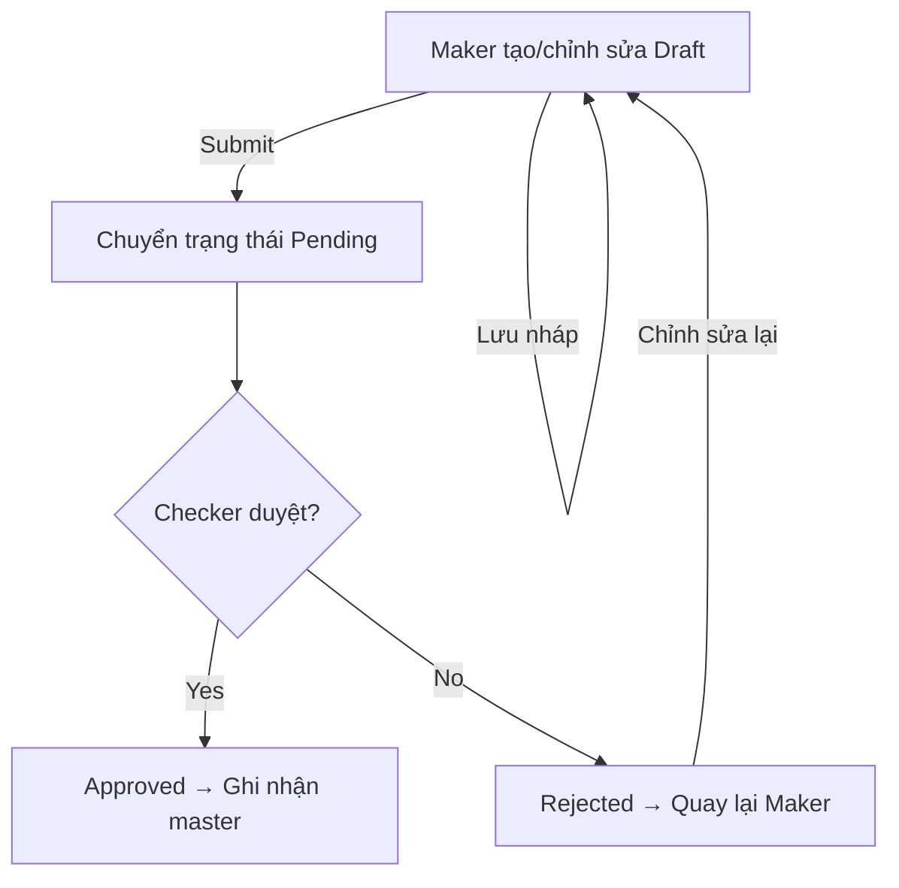

# Luồng Duyệt Thực Thể với Chức Năng Draft/Maker

## 1. Mô tả tổng quan
Luồng này áp dụng cho các thực thể cần phê duyệt (approve) trước khi ghi nhận vào hệ thống. Chức năng **Draft/Maker** cho phép người dùng tạo mới hoặc chỉnh sửa dữ liệu ở trạng thái nháp (Draft), chưa gửi duyệt (Submit).

## 2. Các bước luồng xử lý

### Bước 1: Tạo mới hoặc chỉnh sửa ở trạng thái Draft
- Người dùng (Maker) tạo mới hoặc chỉnh sửa thực thể.
- Dữ liệu được lưu với trạng thái `Draft` (chưa gửi duyệt).
- Maker có thể lưu nhiều lần, chỉnh sửa, xóa bản nháp trước khi submit.

### Bước 2: Gửi duyệt (Submit)
- Khi hoàn tất, Maker thực hiện thao tác gửi duyệt.
- Trạng thái chuyển sang `Pending` (chờ duyệt).
- Không cho phép chỉnh sửa bản ghi khi đã submit.

### Bước 3: Duyệt hoặc từ chối
- Người duyệt (Checker/Approver) xem xét yêu cầu.
- Có thể **Approve** (phê duyệt) hoặc **Reject** (từ chối).
- Nếu duyệt: cập nhật trạng thái thực thể, ghi nhận vào bảng master, ghi log audit.
- Nếu từ chối: trạng thái chuyển về `Rejected`, Maker có thể chỉnh sửa lại và gửi duyệt lại.

### Bước 4: Kết thúc
- Sau khi được duyệt, dữ liệu chính thức ghi nhận vào hệ thống.
- Nếu bị từ chối, Maker có thể tiếp tục chỉnh sửa và gửi lại.

## 3. Lưu ý triển khai
- Sử dụng bảng request header/data để lưu trạng thái Draft/Pending/Rejected.
- Audit log cho mọi thao tác chuyển trạng thái.
- Kiểm soát quyền Maker/Checker rõ ràng.
- Có thể áp dụng cache invalidation nếu dữ liệu master bị thay đổi.

## 4. Ví dụ trạng thái
| Trạng thái   | Ý nghĩa                        |
|--------------|-------------------------------|
| Draft        | Đang nhập, chưa gửi duyệt      |
| Pending      | Đã gửi duyệt, chờ phê duyệt    |
| Approved     | Đã được duyệt, ghi nhận master |
| Rejected     | Bị từ chối, chờ chỉnh sửa lại  |

## 5. Sơ đồ luồng (minh họa)

- CODE: Nên tự upper, không có dấu cách
